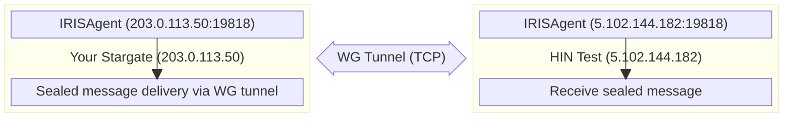
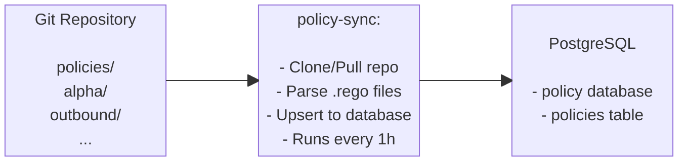

# Stargate Docker advanced configuration

## Backups

### Automatic Backups

* Daily backups run at 2:00 AM via cron (set up during install)
* Backups stored in `./backups/` as timestamped `.tar.gz` files
* Old backups (>7 days) are automatically cleaned up

### What's Included in Backups

* **Full PostgreSQL dump** (all databases with users and permissions)
* **Individual database dumps** (for partial restore if needed)
* **Vault keys** (`vault-keys.json` for unsealing)
* **Customer configuration** (`customer-config.sh` with WireGuard key)
* **S/MIME CSR and certificates** (any `.crt`, `.pem`, `.cer` files)
* **Backup manifest** (`manifest.json` with metadata)

### Manual Backup

```bash
./scripts/backup.sh
```

Creates a compressed archive in `./backups/YYYYMMDD_HHMMSS.tar.gz`.

### Restore from Backup

To restore on a **new machine** or after a **purge**. Copy the backup archive to the new machine and execute:

```bash
./scripts/restore.sh backups/20260130_143022.tar.gz
```

The restore script will:

1. Stop any running services
2. Extract and validate the backup
3. Install Docker if needed
4. Restore customer configuration
5. Start infrastructure services (PostgreSQL, Vault, MinIO)
6. Restore the database
7. Unseal Vault with backed-up keys
8. Start application services

### Partial Restore (single database)

If you only need to restore one database:

#### Extract backup

```bash
tar -xzf backups/20260130_143022.tar.gz -C /tmp/
```

#### Restore a specific database

```bash
cat /tmp/20260130_143022/database/mxengine.sql | docker exec -i stargate-postgres psql -U postgres -d mxengine
```

## Updating Stargate

### Update Deployment Scripts and Configuration

The Stargate deployment repository receives updates to scripts (`install.sh`, `start.sh`, `health-check.sh`, `restore.sh`, etc.), configuration templates, and documentation. To apply these updates:

#### 1. Create a backup before updating

```bash
./scripts/backup.sh
```

#### 2. Pull the latest changes from the repository

```bash
git pull
```

#### 3. Restart services to pick up any script or config changes

```bash
./scripts/stop.sh
./scripts/start.sh
```

!!! note
    `git pull` will not overwrite your `customer-config.sh`, `.env`, or `secrets/` directory - these are in `.gitignore`. If you have local changes to tracked files (e.g. `docker-compose.yml`), git will warn you. In that case, stash your changes first with `git stash`, pull, then re-apply with `git stash pop`.

If the update includes changes to the config template, compare it with your existing config to see if new variables were added:

```bash
diff customer-config.sh customer-config-preprod.example.sh   # or customer-config-prod.example.sh
```

### Update Service Images

#### Update a Single Service

Edit the version in `.env`:

```bash
sed -i 's/MXENGINE_VERSION=.*/MXENGINE_VERSION=v0.0.31/' .env
```

Then pull the container and recreate:

```bash
docker compose pull mxengine
docker compose up -d --force-recreate mxengine
```

#### Quick Test (without editing .env)

Override the version directly:

```bash
MXENGINE_VERSION=v0.0.31 docker compose up -d --force-recreate mxengine
```

#### Update Multiple Services

Edit versions in `.env`, then pull containers and recreate:

```bash
docker compose pull smimekeys-client policy irisagent mxengine
docker compose up -d --force-recreate smimekeys-client policy irisagent mxengine
```

#### Update All Services

Pull all latest images

```bash
docker compose pull
```

Recreate all services

```bash
docker compose up -d --force-recreate
```

#### Cleanup Old Images

After updates, remove unused images to free disk space:

```bash
docker image prune -f
```

#### Rollback

To roll back, edit `.env` to the previous version and recreate:

```bash
sed -i 's/MXENGINE_VERSION=.*/MXENGINE_VERSION=v0.0.30/' .env
docker compose up -d --force-recreate mxengine
```

## Configuration

The `.env` file is generated by `install.sh` from `customer-config.sh`. Domain, certificate, and WireGuard settings are managed at runtime by the dashboard (`/installation`, `/onboarding`, `/mail`) — they are not held in `.env`. To customize the install-time settings, edit `customer-config.sh` and re-run `install.sh`.

Key sections in the generated `.env`:

```bash
## PostgreSQL (auto-generated if empty in customer-config.sh)
POSTGRES_USER=postgres
POSTGRES_PASSWORD=<auto-generated>

## Vault (auto-populated after initialization)
VAULT_TOKEN=<auto-generated>

## S3 Object Storage (SeaweedFS)
S3_ACCESS_KEY=minioadmin
S3_SECRET_KEY=<auto-generated>

## Application Versions
SMIMEKEYS_VERSION=v0.0.5
POLICY_VERSION=v0.0.5
IRISAGENT_VERSION=v0.0.6-branch
MXENGINE_VERSION=v0.0.35
MTACONF_VERSION=dev

## Mail Outbound Path
MXENGINE_PUBLIC_ADDRESS=http://203.0.113.50:8084
OUTBOUND_SEALER_MX_DOMAIN=hintest.ch

## WireGuard
WG_LOCAL_IP=203.0.113.50
WG_INTERFACE_PORT=19818
WG_TRANSPORT_MODE=tcp
```

!!! warning
    **Do not edit `.env` directly.** Changes will be overwritten on re-run of `install.sh`. For runtime configuration (domains, hostname, peers, S/MIME), use the dashboard.

## Service URLs

| Service | URL/Port |
|---------|----------|
| Dashboard | <https://localhost> |
| smimekeys-client | <http://localhost:8081> |
| policy | <http://localhost:8082> |
| irisagent | <http://localhost:8083> |
| mxengine HTTP | <http://localhost:8084> |
| Stalwart SMTP | localhost:25 |
| APISIX Gateway | <http://localhost:9080> |
| Keycloak | <https://localhost:8180> |
| PostgreSQL | localhost:5432 |

## Health Checks

All services expose a `/liveness` endpoint:

```bash
curl http://localhost:8081/liveness  # smimekeys-client
curl http://localhost:8082/liveness  # policy
curl http://localhost:8083/liveness  # irisagent
curl http://localhost:8084/liveness  # mxengine
```

## Monitoring

### Prometheus Metrics

All application services expose Prometheus metrics on port 2112 (internally), mapped to different host ports:

| Service | Metrics Port | Metrics URL |
|---------|--------------|-------------|
| smimekeys-client | 2113 | <http://localhost:2113/metrics> |
| irisagent | 2114 | <http://localhost:2114/metrics> |
| policy | 2115 | <http://localhost:2115/metrics> |
| mxengine | 2116 | <http://localhost:2116/metrics> |
| node-exporter | 9100 | <http://localhost:9100/metrics> |

### Prometheus Scrape Config Example

```yaml
scrape_configs:
  - job_name: 'stargate-smimekeys'
    static_configs:
      - targets: ['<host>:2113']
  - job_name: 'stargate-irisagent'
    static_configs:
      - targets: ['<host>:2114']
  - job_name: 'stargate-policy'
    static_configs:
      - targets: ['<host>:2115']
  - job_name: 'stargate-mxengine'
    static_configs:
      - targets: ['<host>:2116']
  - job_name: 'stargate-node'
    static_configs:
      - targets: ['<host>:9100']
```

### Quick Metrics Check

```bash
## Check all metrics endpoints
curl -s http://localhost:2113/metrics | head -20  # smimekeys-client
curl -s http://localhost:2114/metrics | head -20  # irisagent
curl -s http://localhost:2115/metrics | head -20  # policy
curl -s http://localhost:2116/metrics | head -20  # mxengine
curl -s http://localhost:9100/metrics | head -20  # node-exporter
```

### Log Collection (Alloy → Loki)

Alloy collects logs from application containers and ships them to Loki.

**Containers monitored:**

* stargate-apisix
* stargate-keycloak
* stargate-dashboard
* stargate-smimekeys-client
* stargate-policy
* stargate-policy-sync
* stargate-irisagent
* stargate-mxengine

**Configuration** in `.env`:

```env
## Loki push URL
LOKI_URL=https://loki.example.com

## Hostname label for logs (auto-set to DEPLOYMENT_NAME)
ALLOY_HOSTNAME=stargate-acme
```

**Labels added to logs:**

* `environment=<DEPLOYMENT_NAME>` - Identifies the deployment
* `host=<ALLOY_HOSTNAME>` - Identifies the host (same as deployment name)
* `container=<container-name>` - Container name
* `service=<service-name>` - Service name (e.g., smimekeys-client, policy)
* `level=<log-level>` - Extracted from JSON logs if available

**Query logs in Grafana:**

```logql
{environment="stargate-acme"} |= "error"
{environment="stargate-acme", service="mxengine"}
{environment="stargate-acme", level="error"}
```

**Verify Alloy is working:**

=== "Check Alloy status and recent activity"

    ```bash
    docker logs stargate-alloy
    ```

=== "Health probe (from within the Docker network)"

    ```bash
    docker exec stargate-alloy wget -qO- http://localhost:12345/-/ready
    ```

**Note:** The VM's public IP must be whitelisted in Loki's ingress configuration.

## Stalwart MTA + mtaconf

Stargate uses **Stalwart** as the mail transfer agent and **mtaconf** as the configuration daemon. The dashboard sends domain and relay configuration to mtaconf's REST API, which pushes it to Stalwart via the management CLI.

### Mail Flow Architecture

```plain
External Mail Server
         │
         ▼ (port 25)
┌─────────────────────────────────────────────────────┐
│ stalwart (stargate-stalwart)                        │
│                                                     │
│  Port 25 (smtp listener)                            │
│    │                                                │
│    ▼                                                │
│  content_filter → smtp:[mxengine]:1587              │
│    │                                                │
└────┼────────────────────────────────────────────────┘
     │
     ▼ (port 1587)
┌─────────────────────────────────────────────────────┐
│ MXEngine (stargate-mxengine)                        │
│                                                     │
│  Port 1587 (SMTP input)                             │
│    │                                                │
│    ▼                                                │
│  Sign/encrypt/process mail                          │
│    │                                                │
│    ▼                                                │
│  Deliver back to stalwart for relay                 │
│    │                                                │
└────┼────────────────────────────────────────────────┘
     │
     ▼ (port 10026)
┌─────────────────────────────────────────────────────┐
│ stalwart (stargate-stalwart)                        │
│                                                     │
│  Port 10026 (reinject listener)                     │
│    │                                                │
│    ▼                                                │
│  transport → relay to destination MX                │
│    │                                                │
└────┼────────────────────────────────────────────────┘
     │
     ▼ (port 25)
Destination Mail Server (via MX lookup)
```

**Antivirus scanning:** Inbound mail is scanned by **ClamAV** (`stargate-clamav`), wired into Stalwart as a milter at the SMTP DATA stage on both the public (`:25`) and reinject (`:10026`) listeners. Infected mail is rejected at the SMTP level; if ClamAV is unreachable the message is deferred rather than delivered unscanned (fail-closed). ClamAV's signature database lives in the `clamav_data` volume and is kept current by freshclam in the background.

**Seal callback flow (inbound):** When a remote sealer needs to deliver a sealed message, it calls `MXENGINE_PUBLIC_ADDRESS` (default: `http://<SERVER_STATIC_IP>:8084`). This is why port 8084 must be open for inbound traffic. The `http://` protocol is correct - TLS is not required because the seal payload is already encrypted.

### Mail Relay Configuration

All mail configuration that varies per deployment (mail domains, hostname, relay host, per-domain relay maps, allowed networks) is set through the **dashboard's `/mail` page** at runtime. The dashboard POSTs the configuration to mtaconf's REST API, which applies it to Stalwart without restarting the container.

There is no per-domain config in `customer-config.sh` or `.env` - operators add or change domains through the UI.

### Mail Routing (Migrating from Old MGW)

!!! tip "Key difference from the old HIN-MGW"
    In the old MGW, you had to manually configure a target server per domain. In Stargate, mail routing is decided by **DNS MX records by default** - Stalwart resolves each domain's MX at delivery time. The dashboard's `/mail` page lets you override this per-domain (e.g. to relay back through your M365 / Exchange tenant) without touching DNS.

**Default - automatic via DNS MX:**

For each of your domains, make sure there is an MX record in DNS pointing to the corresponding Exchange (or other mail) server:

```plain
domain1.com    MX 10  exchange1.domain1.com
domain2.com    MX 10  exchange2.domain2.com
domain3.com    MX 10  exchange3.domain3.com
```

This works for any number of domains - each domain can point to a different mail server, and Stalwart will route accordingly.

**If Stargate is the only MX record** for a domain, Stalwart will filter it out and have no delivery target. Add a second MX record pointing to your mail server with a higher priority (= lower number) so Stalwart uses it as the delivery target:

```plain
example.com    MX 10  exchange.example.com      ← delivery target (mail server)
example.com    MX 20  stargate.example.com      ← inbound gateway (Stargate)
```

**Alternative - explicit per-domain relay (sender-based):**

For relay-back through M365 / Exchange Online, configure per-domain relay targets through the dashboard's `/mail` page. Mail from senders not in the map falls back to MX lookup.

### Ports

| Port | Purpose |
|------|---------|
| 25 | Main SMTP listener (external connections) |
| 10026 | Reinjection port (mxengine → stalwart, internal only) |
| 1587 | MXEngine SMTP input (stalwart → mxengine, internal only) |
| 8080 | Stalwart management API + mtaconf REST API (internal only) |

!!! question "Using Exchange?"
    See [Exchange-integration](Exchange-integration.md) for the full Exchange Online / On-Premises connector and transport rule setup.

### Verification

Check Stalwart status
```bash
docker exec stargate-stalwart stalwart-cli -u http://localhost:8080 server list-listeners
```

Check logs
```bash
docker logs stargate-stalwart
```

Test connection to port 25
```bash
telnet localhost 25
```

Test internal port 10026 (from mxengine container)
```bash
docker exec stargate-mxengine nc -zv stalwart 10026
```

### Updating the mtaconf image

The mtaconf container is pulled from the registry. To update to a new tag:

```bash
sed -i 's/MTACONF_VERSION=.*/MTACONF_VERSION=<new-tag>/' .env
docker compose pull mtaconf
docker compose up -d mtaconf
```

### Stargate Troubleshooting

**Mail not being processed by mxengine**:

* Check content_filter is configured: verify mtaconf logs show successful push
* Verify mxengine is reachable: `docker exec stargate-stalwart nc -zv mxengine 1587`

**Mail stuck after mxengine processing**:

* Check mxengine outbound config: OUTBOUND_SMTP_HOST=stalwart, OUTBOUND_SMTP_PORT=10026
* Verify port 10026 listener is active in Stalwart
* Check allowed relay networks include Docker network (172.x.x.x/16)

**Greylisting errors (450 4.7.1)**:

* This is normal! The destination server is temporarily rejecting mail
* Stalwart automatically retries after a configurable delay
* Check queue via management API

**Microsoft blocking IP (S3140)**:

* Your server's IP has poor reputation with Microsoft
* Request delisting at: <https://sender.office.com>
* May take 24-48 hours to take effect

**DNS Lookup Failures**:

* Use the dashboard's `/mail` page to set an explicit relay host or per-domain relay map (skips MX-based discovery)

**Connection Refused on port 25**:

* Ensure port 25 is not blocked by the firewall
* Check if another service is using port 25: `ss -tlnp | grep :25`

## WireGuard (Agent-to-Agent Communication)

IRISAgent uses WireGuard to establish secure encrypted tunnels between Stargate instances for delivering sealed messages.

### How It Works

Each Stargate instance uses its server's real static public IP as the WireGuard tunnel address. This guarantees uniqueness across all deployments without manual coordination.



### WireGuard Configuration

WireGuard settings in `customer-config.sh`:

```bash
## ==============================================================================
## Server IP — used as WireGuard tunnel address and MXEngine callback URL
## ==============================================================================
SERVER_STATIC_IP="203.0.113.50"       # Your server's real static public IP

## ==============================================================================
## WireGuard local settings (typically left at defaults)
## ==============================================================================
WG_PRIVATE_KEY=""                     # Auto-generated by IRISAgent, then saved back to config
WG_INTERFACE_PORT="19818"             # Default WireGuard port
WG_TRANSPORT_MODE="tcp"               # "tcp" (default) or "udp"

```

!!! info
    **`WG_LOCAL_IP`** is auto-derived from `SERVER_STATIC_IP`. You do not need to set it separately.

### Peer Connection Setup

WireGuard peer details (public key, endpoint, allowed IPs, etc.) are configured at runtime through the dashboard's `/installation` page. There is no `WG_PEER_*` block in `customer-config.sh` anymore — the peer is set up after the stack is up.

For first-time setup with the HIN Test environment:

1. Bring up the stack with `./scripts/install.sh`.
2. Open the dashboard, follow `/installation` to start the nonce / HIN handshake.
3. Open the IRISAgent logs (`docker compose logs irisagent`) and copy the `wireguard public key:` line. Send it together with `DEPLOYMENT_NAME` and `SERVER_STATIC_IP` to Vereign (<kalin.canov@vereign.com>) so they can register your peer on the CA side.
4. After Vereign confirms registration, complete `/onboarding` in the dashboard to issue the S/MIME certificate.

For any **additional** peer (peer-to-peer between two Stargates), exchange public keys + endpoints with the other party and add the connection through the IRISAgent API:

```bash
curl --location 'localhost:8083/v1/connections' \
--header 'Content-Type: application/json' \
--header 'Accept: application/json' \
--data '{
  "allowedIps": "<IP of new peer>/32",
  "description": "<short description>",
  "endpoint": "<IP of new peer>:19818",
  "externalId": [
    "<domain of new peer>"
  ],
  "name": "<Name of new peer>",
  "presharedKey": "",
  "publicKey": "<public key of new peer>",
  "status": "completed",
  "transport": "tcp",
  "wireguardIp": "<IP of new peer>",
  "wireguardPort": 10080
}'
```

### WireGuard Verification

Check IRISAgent WireGuard interface

```bash
docker exec stargate-irisagent wg show
```

Check connection in database

```bash
docker exec stargate-postgres psql -U postgres -d irisagent \
  -c "SELECT connection_id, name, endpoint, wireguard_ip, transport, status FROM connections;"
```

Check connection external IDs (used for routing)

```bash
docker exec stargate-postgres psql -U postgres -d irisagent \
  -c "SELECT connection_id, external_id FROM connection_external_ids;"
```

Test WireGuard connectivity (check tunnel status from host)

```bash
docker logs stargate-irisagent 2>&1 | grep -i "handshake\|peer.*added\|started listening"
```

Check IRISAgent logs for tunnel activity

```bash
docker logs stargate-irisagent | grep -i wireguard
```

### WireGuard Troubleshooting

**No WireGuard interface:**

* Check IRISAgent logs: `docker logs stargate-irisagent`
* Verify `WG_LOCAL_IP` is set in `.env` (auto-derived from `SERVER_STATIC_IP` — should be this server's static public IP)

**Peer not reachable:**

* Verify remote endpoint is accessible: `nc -zv <endpoint_host> <endpoint_port>`
* Check firewall allows TCP+UDP port 19818
* Verify public keys match on both ends
* If TCP has issues, try setting `WG_TRANSPORT_MODE="udp"` in customer-config.sh

**Connection not in database:**

* Re-run the dashboard's `/installation` page to re-establish the peer connection
* Check irisagent logs: `docker logs stargate-irisagent`

## Policy Sync

The `policy-sync` service automatically syncs OPA/Rego policies from a Git repository to the PostgreSQL database.

### How Policy Sync Works



### Policy Sync Configuration

Settings in `customer-config.sh`:

```bash
## Git repository containing policies (pre-configured with HIN Stargate policies)
POLICY_SYNC_REPO_URL="https://github.com/Health-Info-Net-AG/Stargate-policies.git"

## Optional: Authentication for private repos
POLICY_SYNC_REPO_USER=""
POLICY_SYNC_REPO_PASS=""

## Optional: Specific branch (default: main)
POLICY_SYNC_REPO_BRANCH=""

## Optional: Subfolder within repo containing policies
POLICY_SYNC_REPO_FOLDER=""

## Sync interval (default: 1h)
POLICY_SYNC_INTERVAL="1h"
```

### Policy Sync Verification

=== "Check policy-sync status"

    ```bash
    docker logs stargate-policy-sync
    ```

=== "View synced policies"

    ```bash
    docker exec stargate-postgres psql -U postgres -d policy \
      -c "SELECT name, policy_group, filename, to_timestamp(updated_at) as updated FROM policies ORDER BY name;"
    ```

=== "View specific policy content"

    ```bash
    docker exec stargate-postgres psql -U postgres -d policy \
      -c "SELECT rego FROM policies WHERE name='deliveryStrategy' AND policy_group='alpha';"
    ```

### Manual Trigger

To force an immediate sync:

```bash
docker restart stargate-policy-sync
```

## Vault

### Vault Mounts

Vault's API/UI port (8200) is not published to the host; access Vault via the
CLI inside the container (see Manual Vault Operations below).

The following KV-v2 secret engines are created:

* `secret-smimekeys-client`
* `secret-policy`
* `secret-irisagent`
* `secret-mxengine`
* `secret-mtaconf`

### Manual Vault Operations

=== "Check status"

    ```bash
    docker exec stargate-vault vault status
    ```

=== "List mounts"

    ```bash
    docker exec -e VAULT_TOKEN=<token> stargate-vault vault secrets list
    ```

=== "Write a secret"

    ```bash
    docker exec -e VAULT_TOKEN=<token> stargate-vault vault kv put secret-smimekeys-client/test key=value
    ```

## Databases

PostgreSQL databases created:

* `smimekeys_client`
* `policy`
* `irisagent`
* `mxengine`

### Connect to PostgreSQL

```bash
docker exec -it stargate-postgres psql -U postgres
```

Or connect externally

```bash
psql -h localhost -U postgres -d smimekeys_client
```

## Policies (Rego)

MXEngine uses OPA/Rego policies stored in PostgreSQL to determine mail delivery strategy.

**Recommended:** Use `policy-sync` to automatically sync policies from a Git repository. See [Policy Sync](#policy-sync) section.

### View Current Policy

=== "List all policies"
    ```bash
    docker exec stargate-postgres psql -U postgres -d policy \
      -c "SELECT id, name, policy_group, filename, to_timestamp(updated_at) as updated FROM policies;"
    ```

=== "View policy content"

    ```bash
    docker exec stargate-postgres psql -U postgres -d policy \
      -c "SELECT rego FROM policies WHERE name='deliveryStrategy';"
    ```

### Policy Location

* **MXEngine config:** `POLICY_OUTBOUND: "outbound/delivery"`
* **Database:** `policy` database, `policies` table
* **Managed by:** `policy-sync` service (syncs from Git repository)

## Logs

=== "All Services"

    ```bash
    docker compose logs -f
    ```

=== "Specific service"

    ```bash
    docker compose logs -f <service>
    ```

    E.g.:

    ```bash
    docker compose logs -f smimekeys-client
    docker compose logs -f vault
    ```

## Troubleshooting

### Certificate issuance failed / WireGuard tunnel not established

This is the most common issue after initial installation. The S/MIME certificate cannot be issued because the WireGuard tunnel to the HIN CA is not established.

**Symptoms:**

* The dashboard's `/onboarding` page reports CSR submission failure
* smimekeys-client logs show: `issue certificate error: certcatunnel: error sending request: irisagent: ... context deadline exceeded`

**Root causes (check in order):**

1. **Peer not registered on HIN CA** - Your WireGuard public key must be registered on the HIN side. Provide HIN with:

   ```bash
   # Get your WireGuard public key
   docker compose logs irisagent | grep "public key"
   ```

   Along with your `DEPLOYMENT_NAME`, `SERVER_STATIC_IP`, and `WG_INTERFACE_PORT` (if changed from 19818).

2. **Firewall blocking port 19818** - Ensure `19818/TCP` is open both inbound and outbound on the Stargate server.

3. **Wrong hostname** - If the Stalwart hostname is still set to the template default (`mail.example.com`), update it via the dashboard's `/mail` page.

**After the issue is resolved:**

Re-open the dashboard's `/onboarding` page to regenerate the CSR and resubmit it through the now-up tunnel.

See [Step 5: WireGuard Peer Registration](Docker-deploy.md#step-5-wireguard-peer-registration) for the full process.

### Vault is sealed after restart

Run the start script which handles unsealing:

```bash
./scripts/start.sh
```

### Cannot pull images

Login to the registry:

```bash
docker login hub.docker.com
```

### Service won't start

Check logs:

```bash
docker compose logs <service-name>
```

### Reset everything

!!! warning
    These commands **DELETE ALL DATA** - use with caution!

    You can only restore data if you perform [backup operations](./Docker-advanced.md#manual-backup) before and save the backup in a safe place.

```bash
./scripts/purge.sh
./scripts/install.sh
```

## Files Structure

```plain
stargate/
├── backups/                      # Full backups (gitignored)
│   └── *.tar.gz
├── config
│   ├── apisix
│   │   ├── apisix.yaml.template
│   │   ├── config.yaml
│   │   └── generated
│   │       └── apisix.yaml
│   ├── keycloak
│   │   ├── generated
│   │   └── realm-stargate.json
│   ├── nats
│   │   └── nats.conf
│   ├── nginx
│   │   ├── dashboard.conf
│   │   └── keycloak.conf
│   ├── alloy
│   │   └── config.alloy          # Alloy log shipping config
│   └── vault
│       └── vault.hcl             # Vault configuration
├── customer-config-preprod.example.sh  # Per-environment config templates (prod/preprod)
├── customer-config-prod.example.sh     #   (copy one to customer-config.sh)
├── customer-config.sh            # Customer-specific settings (copied from a template)
├── docker-compose.yml            # Main compose file
├── .env                          # Environment variables (generated by install.sh)
├── init
│   └── postgres
│       └── 01-create-databases.sql
├── scripts
│   ├── backup.sh                 # Full backup (DB, Vault, config, certs)
│   ├── gather-app-versions.sh    # Collects app versions for node-exporter metrics
│   ├── health-check.sh           # Comprehensive health check of all services
│   ├── init-keycloak.sh
│   ├── init-vault.sh             # Vault initialization (used by vault-init container)
│   ├── install.sh                # First-time installation (Docker, Vault). Domain/cert/peer setup happens in the dashboard afterwards.
│   ├── purge.sh                  # Delete all data (destructive!)
│   ├── restore.sh                # Restore from backup archive
│   ├── send-logs-to-support.sh   # Paste logs online and get a link that you will provide to support
│   ├── start.sh                  # Start services + unseal Vault
│   ├── stop.sh                   # Stop containers (preserves data)
│   └── update.sh
└── secrets/                      # Created on first run (gitignored)
    ├── vault-keys.json           # Vault unseal keys (BACK THIS UP!)
    └── signing-key.csr           # S/MIME certificate signing request
```

## Quick Health & Log Checks

!!! example "Run the comprehensive health check"

    === "Quick Health check"

        ```bash
        ./scripts/health-check.sh
        ```

    === "Verbose Output"

        ```bash
        ./scripts/health-check.sh -v
        ```

        With verbose output (shows WireGuard details, liveness responses).

This checks:

* All container statuses (running, healthy)
* Liveness endpoints (smimekeys-client, policy, irisagent, mxengine)
* Vault seal status
* PostgreSQL connectivity and all 4 databases
* MinIO health
* WireGuard tunnel status and peer handshakes
* Stalwart MTA (running, port 25, port 10026)
* Prometheus metrics endpoints
* Disk and memory usage

For manual log inspection:

Check logs (last 10 lines)

```bash
docker logs stargate-smimekeys-client --tail 10
docker logs stargate-policy --tail 10
docker logs stargate-irisagent --tail 10
docker logs stargate-mxengine --tail 10
```

Follow logs in real-time

```bash
docker logs -f stargate-mxengine
```

Check all container statuses

```bash
docker ps -a --format 'table {{.Names}}\t{{.Status}}'
```

Follow all containers logs in real-time

```bash
docker ps -a --format '{{.Names}}' | xargs -I {} sh -c 'docker logs --timestamps -f {} 2>&1 | sed "s/^/[{}] /"'
```

### Provide logs to support

You can provide logs to our support via [pastebin.hin-infra.ch](https://pastebin.hin-infra.ch), and CLI command:

Upload all containers logs:

=== "All"

    Use our script:

    ```shell
    ./scripts/send-logs-to-support.sh --all
    ```

    Or execute manually:

    ```shell
    docker ps -a --format '{{.Names}}' | xargs -I {} sh -c 'docker logs --timestamps {} 2>&1 | sed "s/^/[{}] /"' | curl https://pastebin.hin-infra.ch/ --data-binary @-
    ```
    !!! tip
        This operation can hit our upload limits - 20 Mb.

=== "For the last hour (`1h`)"

    Use our script:

    ```shell
    ./scripts/send-logs-to-support.sh --since 1h
    ```

    Or execute manually:

    ```shell
    docker ps -a --format '{{.Names}}' | xargs -I {} sh -c 'docker logs --since 1h --timestamps {} 2>&1 | sed "s/^/[{}] /"' | curl https://pastebin.hin-infra.ch/ --data-binary @-
    ```

=== "Last 500 lines of logs"

    !!! success "This is default"
        `--tail 500` is the default value for our script, but you can still provide it.

    Use our script:

    ```shell
    ./scripts/send-logs-to-support.sh --tail 500
    ```

    Or execute manually:

    ```shell
    docker ps -a --format '{{.Names}}' | xargs -I {} sh -c 'docker logs --tail 500 --timestamps {} 2>&1 | sed "s/^/[{}] /"' | curl https://pastebin.hin-infra.ch/ --data-binary @-
    ```

Upload specific container logs:

=== "All"

    ```shell
    docker logs <CONTAINER_NAME> 2>&1 | curl https://pastebin.hin-infra.ch/ --data-binary @-
    ```

    !!! tip
        This operation can hit our upload limits - 20 Mb. If it happens, try to reduce the log amount by setting a time limit or number of lines.

=== "For the last hour (`1h`)"

    ```shell
    docker logs --since 1h <CONTAINER_NAME> 2>&1 | curl https://pastebin.hin-infra.ch/ --data-binary @-
    ```

=== "Last 500 lines of logs"

    ```shell
    docker logs --tail 500 <CONTAINER_NAME> 2>&1 | curl https://pastebin.hin-infra.ch/ --data-binary @-
    ```

After that, you will receive a unique link in the format `https://pastebin.hin-infra.ch/<20 symbols>` that you can provide to support / ticket.

!!! warning

    The expiration time is set to 30 days. If some parts of the logs or the logs themselves need to be saved for a longer period, please make sure you keep a copy of them.
