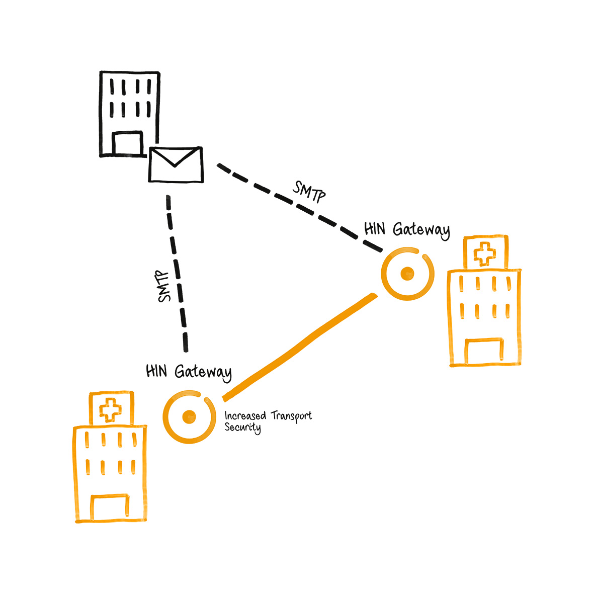
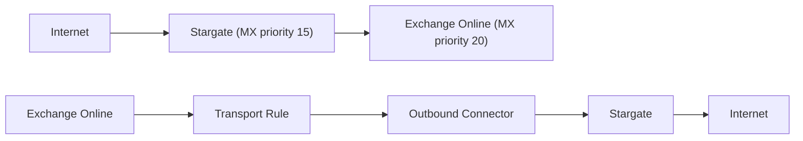
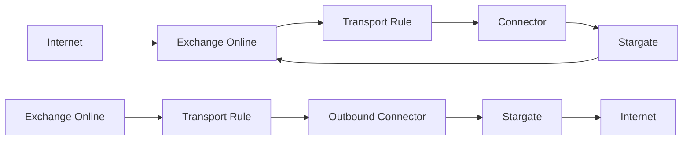

# Exchange Integration with Stargate

This guide explains how to configure Microsoft Exchange (Online and On-Premises) to route mail through the Stargate gateway for S/MIME signing and encryption.

<!-- Internal reference
     This guide is based on the [Stargate mail relay setup](https://plan.vereign.com/projects/mail-gateway/wiki/stargate-mail-relay-setup) wiki page (by Zdravko Komitov). -->

{ width=32%; }
{ width=32%; }
{ width=32%; }

## Overview

Stargate acts as a mail relay between external mail servers and your Exchange environment. Two integration patterns are supported:

**Pattern A - Stargate as primary MX (recommended for inbound S/MIME processing):**



**Pattern B - Exchange Online as primary MX with transport rules:**



In both patterns, you need:

1. **DNS records** pointing to the Stargate server
2. **Outbound connector** - routes mail from Exchange to Stargate
3. **Inbound connector** - accepts mail from Stargate into Exchange
4. **Transport rule** - triggers the outbound connector for external recipients

## Prerequisites

Before configuring Exchange, ensure:

- [X] Stargate is installed and running ([deployment instructions](Docker-deploy.md))
- [X] You have the **Stargate server's public IP address** (referred to as `<STARGATE_IP>` below)
- [X] You have the **mail hostname** of the Stargate server (referred to as `<MAIL_HOSTNAME>`, e.g. `mail.example.com`)
- [X] You know your **mail domain** (referred to as `<YOUR_DOMAIN>`, e.g. `example.com`)
- [X] You have **Exchange admin** access (Exchange Admin Center or on-premises Exchange Management Shell)
- [X] DNS records are configured per the [DNS Setup Guide](DNS-setup.md) (A, MX, SPF at minimum)

---

## Part 1: DNS Setup

See the [DNS Setup Guide](DNS-setup.md) for complete instructions on configuring A, MX, SPF, PTR, DMARC, and DKIM records.

At minimum, before proceeding with the Exchange configuration below, you need:

- **A record**: `<MAIL_HOSTNAME>` pointing to `<STARGATE_IP>`
- **MX record**: `<YOUR_DOMAIN>` with Stargate at higher priority (lower number) than Exchange
- **SPF record**: `ip4:<STARGATE_IP>` and `ip4:<HIN_SEALER_IP>` added to your domain's TXT record (see [DNS Setup Guide - SPF](DNS-setup.md#spf-record) for sealer IPs)

---

## Part 2: Exchange Online Configuration

### Step A: Create the Outbound Connector (Office 365 → Stargate)

This connector routes outbound mail from Exchange Online to the Stargate relay server.

1. Navigate to the [Exchange Admin Center - Connectors](https://admin.exchange.microsoft.com/#/connectors)

2. Click **"+ Add a connector"**

3. **Connection from**: Select **"Office 365"**
   - **Connection to**: Select **"Your organization's email server"**
   - Click **"Next"**

4. **Connector name**: Enter a descriptive name, e.g.:

   ```plain
   From Office 365 to Stargate relay server
   ```

   - Check **"Retain internal Exchange email headers"**
   - Click **"Next"**

5. **Use of connector**: Select **"Only when I have a transport rule set up that redirects messages to this connector"**
   - Click **"Next"**

!!! tip
    This is important - the connector won't route any mail by itself. It will only be used when triggered by the transport rule created in Step C.

6. **Routing**: Select **"Route email through these smart hosts"**
   - Enter the Stargate server IP address: `<STARGATE_IP>`
   - Click **"+"** to add it, then click **"Next"**

7. **Security restrictions**: Select **"Any digital certificate, including self-signed certificates"**
   - Click **"Next"**

!!! note
    Stargate uses opportunistic TLS (`smtpd_tls_security_level = may`). Selecting "any digital certificate" ensures connectivity even with self-signed certificates.

8. **Validation email**: Enter a valid email address for your domain (e.g. `user@<YOUR_DOMAIN>`)
   - Click **"+"**, then click **"Validate"**
   - Wait for validation to complete, then click **"Next"**

!!! tip
    For validation to succeed, the Stargate server must be running and accepting mail on port 25.

9. Review the settings and click **"Create connector"**

10. On the confirmation screen, click **"Done"**

### Step B: Create the Inbound Connector (Stargate → Office 365)

This connector accepts mail from the Stargate relay server into Exchange Online.

1. From the [Connectors page](https://admin.exchange.microsoft.com/#/connectors), click **"+ Add a connector"**

2. **Connection from**: Select **"Your organization's email server"**
   - **Connection to**: Shows **"Office 365"** (automatic)
   - Click **"Next"**

3. **Connector name**: Enter a descriptive name, e.g.:

   ```plain
   Receive mail from Stargate relay server
   ```

   - Check **"Retain internal Exchange email headers"**
   - Click **"Next"**

4. **Authenticating sent email**: Select **"By verifying that the IP address of the sending server matches one of the following IP addresses that belong exclusively to your organization"**
   - Enter the Stargate server IP address: `<STARGATE_IP>`
   - Click **"+"** to add it, then click **"Next"**

!!! note
    This tells Exchange Online to trust mail from this specific IP address, bypassing additional spam/authentication checks for mail that has already been processed by Stargate.

5. Review the settings and click **"Create connector"**

6. Click **"Done"**

### Verify Connectors

After creating both connectors, the Connectors page should show:

| Status | Name | From | To |
|--------|------|------|-----|
| On | Receive mail from Stargate relay server | Your org | O365 |
| On | From Office 365 to Stargate relay server | O365 | Your org |

### Step C: Create the Transport Rule

The transport rule redirects all outbound mail through the Stargate outbound connector, except mail originating from Stargate itself (to prevent mail loops).

1. Navigate to [Exchange Admin Center - Rules](https://admin.exchange.microsoft.com/#/transportrules)

2. Click **"+ Add a rule"** → **"Create a new rule"**

3. **Rule name**: Enter a descriptive name, e.g.:

   ```plain
   Relay all mail to Stargate except mail coming from it
   ```

4. **Apply this rule if**: Select **"The recipient..."** → **"is external/internal"** → **"Outside the organization"**
   - Click **"Save"**

!!! note
    This condition ensures only outbound mail (to external recipients) is redirected through Stargate.

5. **Do the following**: Select **"Redirect the message to..."** → **"the following connector"** → select the outbound connector created in Step A (e.g. "From Office 365 to Stargate relay server")
   - Click **"Save"**

6. **Except if**: Click **"+"** to add an exception
   - Select **"The sender..."** → **"IP address is in any of these ranges"**
   - Enter the Stargate server IP address: `<STARGATE_IP>`
   - Click **"Add"**, verify the IP is listed, then click **"Save"**

!!! warning
    **This exception is critical** - it prevents mail loops. Without it, mail from Stargate arriving at Exchange Online would be redirected back to Stargate in an infinite loop.

7. Review the rule summary. It should show:
   - **Apply this rule if**: The recipient is located Outside the organization
   - **Do the following**: Redirect the message to the connector "From Office 365 to Stargate relay server"
   - **Except if**: The sender IP address is in one of these ranges: `<STARGATE_IP>`

8. Click **"Next"**, then **"Next"** again, then **"Finish"**, then **"Done"**

9. **Enable the rule**: The rule is created in a disabled state. Click on the rule in the list and toggle **"Enable or disable rule"** to **"Enabled"**

!!! tip
    Do not forget to enable the rule - it will not work until enabled.

---

## Part 3: On-Premises Exchange Server Configuration

For on-premises Exchange Server (2016, 2019), the setup is similar but configured through the Exchange Management Console (EAC) or Exchange Management Shell (PowerShell).

### Send Connector (On-Premises → Stargate)

Create a Send connector to route outbound mail through Stargate:

**Exchange Management Shell (PowerShell):**

```powershell
New-SendConnector -Name "To Stargate Relay" `
  -AddressSpaces "SMTP:*;1" `
  -SmartHosts "<STARGATE_IP>" `
  -SmartHostAuthMechanism None `
  -DNSRoutingEnabled $false `
  -SourceTransportServers "<YOUR_EXCHANGE_SERVER>"
```

**Exchange Admin Center (GUI):**

1. Navigate to **Mail flow** → **Send connectors**
2. Click **+** to create a new connector
3. **Name**: "To Stargate Relay"
4. **Type**: Select **"Internet"**
5. **Network settings**: Select **"Route mail through smart hosts"**, add `<STARGATE_IP>`
6. **Smart host authentication**: Select **"None"**
7. **Address space**: Add `*` (all domains) or specific external domains
8. **Source server**: Select your Exchange transport server(s)

### Receive Connector (Stargate → On-Premises)

Create or modify a Receive connector to accept mail from Stargate:

**Exchange Management Shell (PowerShell):**

```powershell
New-ReceiveConnector -Name "From Stargate Relay" `
  -Bindings "0.0.0.0:25" `
  -RemoteIPRanges "<STARGATE_IP>" `
  -TransportRole FrontendTransport `
  -Usage Custom `
  -AuthMechanism ExternalAuthoritative `
  -PermissionGroups ExchangeServers
```

**Exchange Admin Center (GUI):**

1. Navigate to **Mail flow** → **Receive connectors**
2. Click **+** to create a new connector
3. **Name**: "From Stargate Relay"
4. **Type**: Select **"Frontend Transport"**
5. **Network adapter bindings**: Leave default or bind to specific IP
6. **Remote network settings**: Remove the default `0.0.0.0-255.255.255.255` and add only `<STARGATE_IP>`
7. **Authentication**: Check **"Externally Secured"**
8. **Permission groups**: Check **"Exchange servers"**

### Transport Rule (On-Premises)

Create a transport rule to redirect outbound mail through the Send connector:

**Exchange Management Shell (PowerShell):**

```powershell
New-TransportRule -Name "Relay outbound via Stargate" `
  -SentToScope NotInOrganization `
  -RouteMessageOutboundConnector "To Stargate Relay" `
  -ExceptIfSenderIpRanges "<STARGATE_IP>"
```

**Exchange Admin Center (GUI):**

1. Navigate to **Mail flow** → **Rules**
2. Click **+** → **"Create a new rule"**
3. **Name**: "Relay outbound via Stargate"
4. **Apply this rule if**: "The recipient is located..." → "Outside the organization"
5. **Do the following**: "Redirect the message to..." → "the following connector" → "To Stargate Relay"
6. **Except if**: "The sender IP address is in..." → add `<STARGATE_IP>`

---

## Part 4: Stargate-Side Configuration

### Automatic Configuration (Default)

By default, Stalwart automatically discovers where to deliver processed mail by looking up MX records for each domain configured via the dashboard's `/mail` page. It filters out its own hostname and uses the remaining MX entries as delivery targets.

This works when:

- Your domain has MX records pointing to both Stargate and Exchange
- Stargate has a higher-priority (lower number) MX record than Exchange

### Manual Override via the dashboard

If you want all outbound mail from Stargate to go to a single Exchange endpoint (e.g. Exchange Online Protection), set the relay host through the dashboard's `/mail` page (e.g. `[smtp.office365.com]`). The dashboard sends the value to mtaconf's REST API and the daemon applies it to Stalwart.

!!! note
    A single relay host sends all mail through one server and does not support per-domain routing. For multiple domains routing through different Exchange servers, use the per-domain relay map on the same dashboard page (configures `sender_dependent_relayhost_maps` under the hood) - see [Multi-Domain Setup](#multi-domain-setup) below.

### Multi-Domain Setup

For setups with multiple domains and different Exchange servers (e.g. BALZ Informatik AG with 26 domains), use MX records for per-domain routing:

```plain
domain1.com    MX 10  exchange1.domain1.com
domain1.com    MX 20  stargate.domain1.com

domain2.com    MX 10  exchange2.domain2.com
domain2.com    MX 20  stargate.domain2.com
```

Each domain's MX records tell Stargate where to deliver processed mail for that specific domain.

### Verify Stargate Configuration

After setup, verify the Stalwart configuration:

#### Check relay configuration

```bash
docker logs stargate-stalwart --tail 50 | grep -i relay
```

#### Check mail queue (should be empty when everything is working)

```bash
docker exec stargate-stalwart stalwart-cli -u http://localhost:8080 queue list
```

#### Send a test email and check logs

```bash
docker logs stargate-stalwart --tail 50
```

## Troubleshooting

### Mail not leaving Exchange Online

- Verify the transport rule is **enabled** (it is created in a disabled state)
- Check the rule conditions - it should apply to recipients "Outside the organization"
- Verify the outbound connector validation passed
- Check Exchange message trace in the Admin Center for delivery status

### Mail loops (duplicate messages)

- Ensure the transport rule has the **exception** for the Stargate IP address
- Without this exception, mail from Stargate arriving at Exchange gets redirected back to Stargate

### Stargate not accepting mail from Exchange

- Check port 25 is open on the Stargate server's firewall
- Verify SPF record includes the Stargate IP
- Check Stalwart logs: `docker logs stargate-stalwart`

### Exchange Online rejecting mail from Stargate

- Verify the inbound connector is configured with the correct Stargate IP
- Check that the Stargate IP hasn't changed
- Verify the connector is enabled (Status: On)

### TLS Certificate Errors

Stargate uses opportunistic TLS with a self-signed certificate. The outbound connector in Exchange should be configured to accept "Any digital certificate, including self-signed certificates". If you see TLS-related errors:

- Verify the outbound connector security setting allows self-signed certificates
- For on-premises Exchange, ensure the Send connector does not require TLS (`-RequireTLS $false`)

### Validation fails during connector creation

The outbound connector validation requires:

- Stargate server is running and accepting connections on port 25
- The validation email address is valid for your domain
- Network path between Exchange Online and Stargate is open (no firewall blocking)

---

## Quick Reference

| Component | Exchange Online Location | Purpose |
|-----------|--------------------------|---------|
| Outbound Connector | Admin Center → Mail flow → Connectors | Route outbound mail to Stargate |
| Inbound Connector | Admin Center → Mail flow → Connectors | Accept mail from Stargate |
| Transport Rule | Admin Center → Mail flow → Rules | Trigger outbound connector for external recipients |

| DNS Record | Example | Purpose |
|------------|---------|---------|
| A | `mail IN A <STARGATE_IP>` | Point hostname to Stargate |
| MX (Stargate) | `@ IN MX 15 mail.<YOUR_DOMAIN>.` | Inbound mail hits Stargate first |
| MX (Exchange) | `@ IN MX 20 <DOMAIN>.mail.protection.outlook.com.` | Fallback / delivery target |
| SPF | `ip4:<STARGATE_IP>` and `ip4:<HIN_SEALER_IP>` added to existing TXT record | Authorize Stargate and HIN sealer to send mail |

For the full DNS setup (including PTR, DMARC, DKIM, and multi-domain), see the [DNS Setup Guide](DNS-setup.md).
