# HIN Mail Gateway - Technical Installation Process

!!! tip
    Technical Installation Process for Single-Domain Mail Architecture with Microsoft 365

## Introduction

This document provides a comprehensive guide to the technical installation and migration process to the new [HIN Gateway](https://www.hin.ch/de/services/hin-mail/hin-gateway.cfm) ("Stargate Appliance"). It applies to Microsoft 365 mail architectures that use a **single trusted domain**.

The guide is intended for HIN customers, IT administrators and system engineers who are responsible for deploying and configuring the new HIN Gateway, and for migrating from the existing Mail Gateway (MGW) to the new solution.

The HIN Gateway is a secure email gateway solution that enables trusted, encrypted and policy-driven communication within the HIN Trust Circle. It acts as a central intermediary between internal email infrastructures and external communication partners, ensuring that all email traffic is transmitted securely, complies with the organisation's policies and meets HIN's security standards.

## Overview of the mail flow

- **Incoming emails** are routed via the HIN Gateway, where they are validated, decrypted (if necessary) and checked against trust and security policies before being forwarded to the internal mail server.
- **Outgoing emails** are sent from internal systems to the HIN Gateway, where encryption, routing and policy enforcement are applied before they are transmitted to external recipients.
- **Communication between HIN gateways** is secured by peer certificates and WireGuard tunnels, ensuring trusted communication between domains.

## Installation and migration process

The structured, step-by-step procedure described in this document covers the following points:

1. Preparation and fallback planning
2. Installation and configuration of the HIN Gateway
3. Domain activation and certificate validation
4. Mail server integration and routing configuration
5. Testing, transition to production and post-migration validation
6. Decommissioning of the existing MGW

HIN's objective in this process is to ensure a secure, smooth and fully validated migration that causes minimal disruption to operations and guarantees the uninterrupted continuity of email services.

## Frequently asked questions

!!! question "Can I perform the installation and migration on my own?"
    Yes, the installation and migration can be completed entirely by the customer, **except for "Step 1.3 - Export private key(s)"**.

    For security reasons and to keep your private key safe, you must contact HIN Support or join the planned migration call to receive the code required to export the private key from the currently operating Mail Gateway.

    If the installation and migration cannot be completed successfully, please join the planned support call with our engineers.

!!! question "Will there be any outage in email delivery during the migration?"
    Between **"Step 1.5 - Shutdown existing MGW VM"** and **"Step 18 - Configure mail server"**, all emails will be queued on the mail server. Once "Step 18 - Configure mail server" has been completed, the queued emails will be sent out or delivered to the mailbox.

!!! question "Will any emails be lost during the installation and migration?"
    No, no emails will be lost during the installation and migration.

## Overview of the installation steps

| Step | Topic | Responsibility |
| :--: | :---- | :------------: |
| 0 | Check prerequisites | Customer |
| 1.1 | Smoke test | Customer |
| 1.2 | Backing up the existing MGW | Customer |
| 1.3 | Export private key(s) | Customer / HIN |
| 1.4 | Contingency plan / fallback scenario | Customer |
| 1.5 | Shutdown existing MGW VM | Customer |
| 2 | WireGuard | Customer |
| 3 | Select target VM | Customer |
| 4 | Load VM image | Customer |
| 5 | Network connection to the VM | Customer |
| 6 | Access via the browser | Customer |
| 7 | Enter activation code | Customer |
| 8 | Mesh network setup | Customer |
| 9 | Establishing secure mesh network | Customer |
| 10 | Login to Keycloak | Customer |
| 11 | Update password | Customer |
| 12 | Update account information | Customer |
| 13 | Initial configuration and domain setup | Customer |
| 14 | Configure mail transport | Customer |
| 15 | Configure whitelist headers | Customer |
| 16 | Peer certificates | HIN |
| 17 | Validate peer certificates | Customer |
| 18 | Configure mail server | Customer |
| 19 | Test prior to switchover | Customer |
| 20 | Validation after switchover | Customer |
| 21 | Take existing MGW out of service | Customer |
| 22 | Change the password of the VM | Customer |
| Annex 1 | Backing up and restoring the appliance settings | Customer |

## Detailed steps

### Step 0 - Check prerequisites


Please review the "Stargate Deployment Instructions" and ensure that all necessary preparatory steps have been completed before the HIN Gateway migration activities begin.

The following items must be available or confirmed before the migration:

- **Credentials will be delivered to you by HIN**
    - VM credential
    - Keycloak credential
    - Activation code
- **Export of private key**
    - If you are working on a Windows machine that has access to the Mail Gateway VM via port 22, we can support you during the call in enabling the private key export from the MGW.
    - If you do not have access to such a machine, please contact HIN Support by email or phone (support@hin.ch / 0848 830 740) to help you establish a support connection via System Administration → Support Connection → Connect.
- **Download latest** version of [VM image](vm/VM-Catalog.md)
- **Firewall** requirements for WireGuard.
  Configure the WireGuard port 19818 (TCP/UDP) in your firewall:
    - Incoming and outgoing traffic
    - Allow traffic: any-to-HIN Gateway and HIN Gateway-to-any
- **DHCP access** should be available for "Step 5 - Network connection to the VM" (recommended).
- **Backup requirements** - see "Annex 1 - Backing up and restoring the appliance settings".
- Confirmation that the existing MGW will **not** be deleted until acceptance has been completed.
- Access to DNS, mail server connectors, transport rules, and relay settings.

!!! info "Why WireGuard?"
    The WireGuard port fulfils two important functions:

    1. The HIN Gateway uses this port to obtain peer certificates from the HIN CA.
    2. It uses this port to establish a secure tunnel to other HIN Gateways, through which secure data exchange (e.g. email traffic) takes place.

!!! tip "Private key export"
    If you are working on a Windows machine that has access to the Mail Gateway VM via port 22, we can support you during the call in enabling the private key export from the MGW.

    If you do not have access to such a machine, please contact HIN Support by email or phone (**support@hin.ch** / **0848 830 740**) to help you establish a support connection via **System Administration → Support Connection → Connect**.

### Step 1.1 - Smoke test


Send a test email to the following recipients, where you have access to the mailbox to check correct receipt:

- An HIN email address or HIN community domain of yours, for example: `user@hin.ch`
- An email address outside of the HIN community, for example: `user@bluewin.ch`

Verify that both emails are delivered successfully, including subject, content and attachment (if sent).

### Step 1.2 - Backing up the existing MGW


Create a backup of the existing MGW appliance and ensure that the VM is retained until the migration has been successfully completed and formally accepted. For more information, see "Annex 1 - Backing up and restoring the appliance settings".

### Step 1.3 - Export private key(s)


:heavy_plus_sign:


!!! warning "HIN assistance required"
    This step requires an unlock code that is provided by a HIN support engineer during the planned call. Contact HIN Support or join the planned migration call before starting.

<!-- !!! info
    Please download tool `HIN_Migration-Tool_v*.exe` under the Link: [link](https://link) -->

1. Log into the existing MGW webGUI.
2. Open **"Mail System"**.
3. Run the **`HIN_Migration-Tool_v*.exe`** application provided by the support engineer during the call.
4. Enter the unlock code that the support engineer provides to you.
5. Select **"Enable export"**.
6. Enter the MGW IP address.
7. Wait for confirmation.
8. Select the trusted domain in the MGW webGUI.
9. Scroll down and select the managed fingerprint.
10. Scroll down to the **"PKCS12 download"** category (you may optionally enter a password to encrypt the key). Press **"Download PKCS12"** and save the `*.p12` file on the computer.
11. Return to the `HIN_Migration-Tool_v*.exe` application and disable the **Export** button.

### Step 1.4 - Contingency plan / fallback scenario


**Rollback scenario** - if a rollback is required:

1. Stop the new HIN Gateway.
2. Power on the existing MGW.
3. Verify that inbound and outbound email traffic is functioning correctly via the existing MGW.

### Step 1.5 - Shutdown existing MGW VM


Shut down the existing MGW VM.

!!! warning
    This step will interrupt the mail flow. During the interruption, emails will be queued on the mail server and delivered after the installation has been completed (see "Step 18 - Configure mail server").

### Step 2 - WireGuard


Ensure you have configured the WireGuard port `19818` (TCP/UDP) in your firewall:

- Incoming and outgoing traffic
- Allow traffic: any-to-HIN Gateway and HIN Gateway-to-any

### Step 3 - Select target VM


Select one of the available virtual images and provision it as described in the installation guide on the HIN Gateway service page:

!!! info
    For security and supportability reasons, ensure that your hypervisor is not running an end-of-life version. The HIN Gateway appliance is supported on the latest hypervisor release and the immediately preceding major version.

- VM Image Installation:
    - [Azure VM Image](vm/Azure-image-install.md)
    - [Windows 11 Pro (Hyper-V) Image](vm/Windows11pro-image-install.md)
    - [VMware image](vm/VMware-image-install.md)
    - [Proxmox image](vm/Proxmox-image-install.md)
    - [Cloudscale](vm/Cloudscale-image-install.md)
- [Configuration of Microsoft Exchange](Exchange-integration.md)

### Step 4 - Load VM image


Upload the selected VM image to your hypervisor.

### Step 5 - Network connection to the VM


Ensure that the VM has a network connection and that a static IP address has been assigned to it. 

**Option A:** Configure the IP address of the virtual machine directly in the hypervisor you are using.

**Option B:** You can configure your router's DHCP server to always assign the same IP address based on the VM's MAC address.

**Option C:** Log in locally via the VM console and manually configure a static IP address.
NOTE: The VM image runs an automatic installation during the first boot. If the network is not configured at this stage, the installation will fail because the server’s IP address cannot be determined.

Add an IP address on Linux:

1. Run the «nmtui» command in the console
    ```bash
    nmtui
    ```
2. Use the arrow keys to navigate, then press «Enter» to select the «Ethernet connection» for which you want to change the IP address. <br> 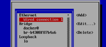{ style="position:relative;left:50%;transform:translate(-50%,0%);" }
3. Navigate to «IPv4 Configuration» and change the setting from «Automatic» to «Manual». <br> 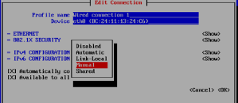{ style="position:relative;left:50%;transform:translate(-50%,0%);" }
4. Use the arrow keys to navigate to the fields where you can enter the IP address, gateway, and DNS server. Then select «OK». <br> 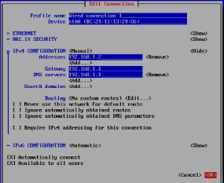{ style="position:relative;left:50%;transform:translate(-50%,0%);" }
5. After saving the IP address configuration, run the following command in the console:
    ```bash
    sudo systemctl restart NetworkManager
    ```

??? warning "Network must be configured before first boot"
    The VM image runs an automatic installation on first boot. If the network is not yet configured (no IP address assigned via DHCP or static config), the installation will fail because the server IP cannot be detected.

    If this happens, configure the network manually, then run:

    ```bash
    cd /root/stargate-deployment/docker-compose
    ./scripts/purge.sh
    ./scripts/install.sh
    ```

    The install script will auto-detect the server's IP from the default route. Any reachable IP (public or private) is sufficient - the actual public endpoint is configured later through the dashboard.

!!! tip
    If you used Option C and configured the network manually, you must run the following commands:
    
    ```bash
    cd /root/stargate-deployment/docker-compose
    ./scripts/purge.sh
    ./scripts/install.sh
    ```

    The installation script will automatically detect the server’s IP address from the default route. Any reachable IP address, whether public or private, is sufficient. The actual public endpoint is configured later through the dashboard.
    
    After the scripts have completed successfully, proceed to «Step 6 – Access via the browser»
    
    !!! question
        If you do not have the HIN admin credentials, please contact HIN Support by email or phone (**support@hin.ch** / **0848 830 740**). Please refer to [Support Section](./Support.md).

        [Click here to send an Email](mailto:support@hin.ch?subject=Password%20required%20for%20VM%20installation.&body=Hello%20dear%20Support,%0A%0AI%20would%20like%20to%20receive%20the%20password%20for%20a%20VM%20installation.%0A%0APLEASE%20PROVIDE%20YOUR%20CUSTOMER%20INFO%20HERE){ .md-button style="position:relative;left:50%;transform:translate(-50%,0%);" }

### Step 6 - Access via the browser


Open a browser and enter the IP address configured for the VM. You should see the initial setup screen.

```plain
https://<VM IP address>
```

### Step 7 - Enter activation code


Select your preferred language and enter the activation code that you received via email from HIN. Click on "Next".

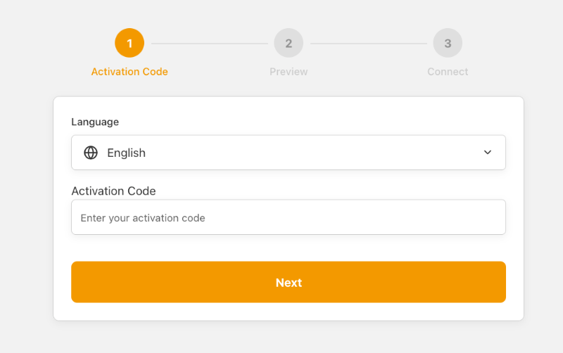

!!! question
    If you do not have the activation code, please contact HIN Support by email or phone (**support@hin.ch** / **0848 830 740**). Please refer to [Support Section](./Support.md).

    [Click here to send an Email](mailto:support@hin.ch?subject=Activation%20code%20required.&body=Hello%20dear%20Support,%0A%0AI%20would%20like%20to%20receive%20the%20activation%20code%20for%20my%20HIN%20Gateway%20installation.%0A%0APLEASE%20PROVIDE%20YOUR%20CUSTOMER%20INFO%20HERE){ .md-button style="position:relative;left:50%;transform:translate(-50%,0%);" }

### Step 8 - Mesh network setup


Verify the mesh network configuration:

- **IP address** - The public IP of the outgoing traffic (auto-detected).
- **Transport** - The transport protocol (default: `tcp`).
- **Port** - The WireGuard port (default: `19818`).

Confirm that the values are correct and click "Next".

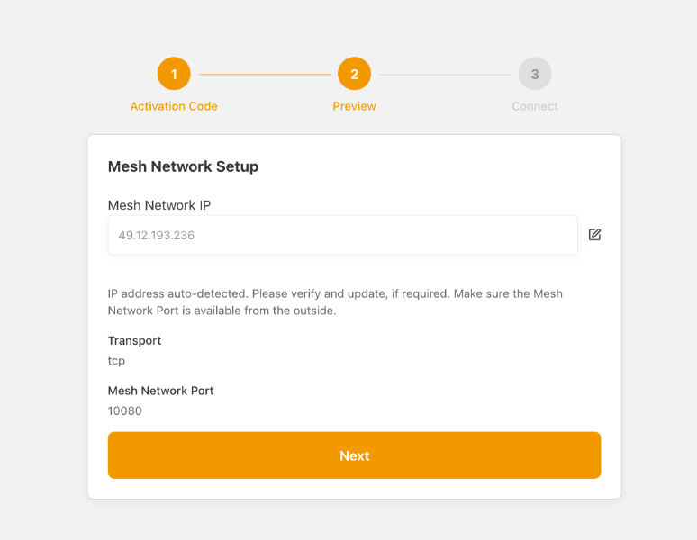

### Step 9 - Establishing secure mesh network


The system will now establish the secure mesh network connection. This step connects the HIN Gateway to the Iris Agent and synchronises certificates.

Wait until the process completes. The status indicators will show "Up" when the connection is successfully established. Click "Finish".

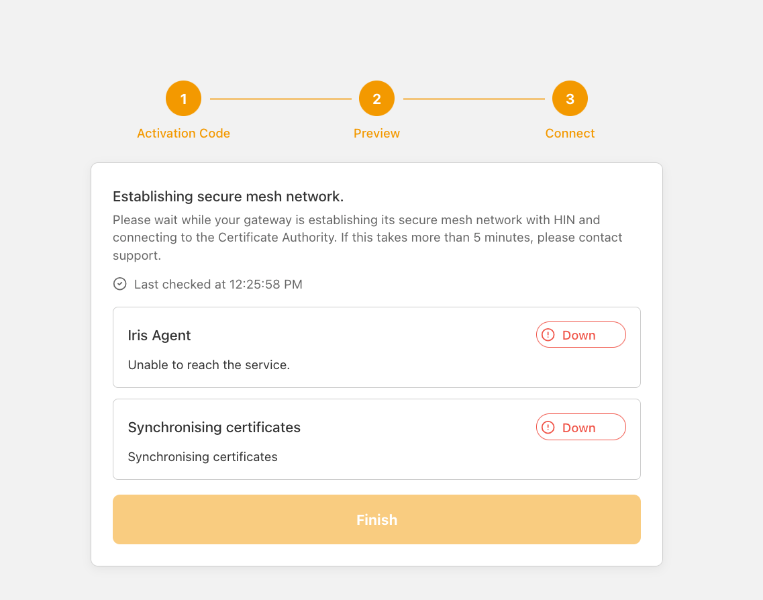

!!! failure "If the connection fails"
    If the Iris Agent or certificate synchronisation status remains "Down":

    - Verify that port `19818` (TCP/UDP) is open in your firewall (see "Step 2 - WireGuard").
    - Verify that the IP address in "Step 8 - Mesh network setup" is correct and reachable from the internet.
    - Restart the process or contact HIN Support by email or phone (**support@hin.ch** / **0848 830 740**).

### Step 10 - Login to Keycloak


Once the mesh network is established, you will be redirected to the Keycloak login page. Enter the username and password received from HIN.

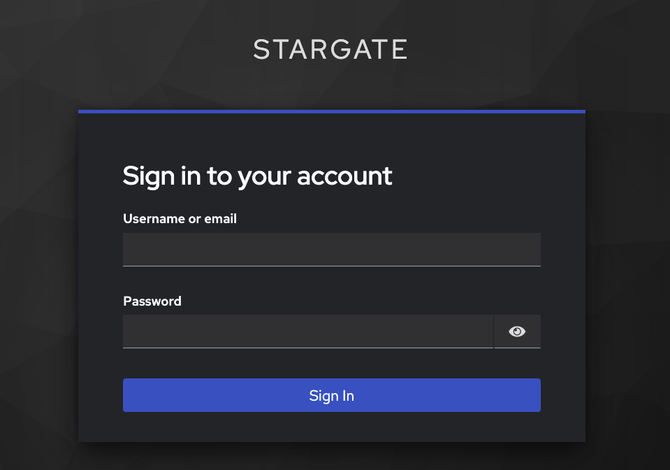

!!! question
    If you do not have these login details, please contact HIN Support by email or phone (**support@hin.ch** / **0848 830 740**). Please refer to [Support Section](./Support.md).

    [Click here to send an Email](mailto:support@hin.ch?subject=Keycloak%20login%20required.&body=Hello%20dear%20Support,%0A%0AI%20would%20like%20to%20receive%20the%20Keycloak%20login%20details%20for%20my%20HIN%20Gateway.%0A%0APLEASE%20PROVIDE%20YOUR%20CUSTOMER%20INFO%20HERE){ .md-button style="position:relative;left:50%;transform:translate(-50%,0%);" }

### Step 11 - Update password


On first login, you will be prompted to change your password. Enter a new secure password and confirm it.

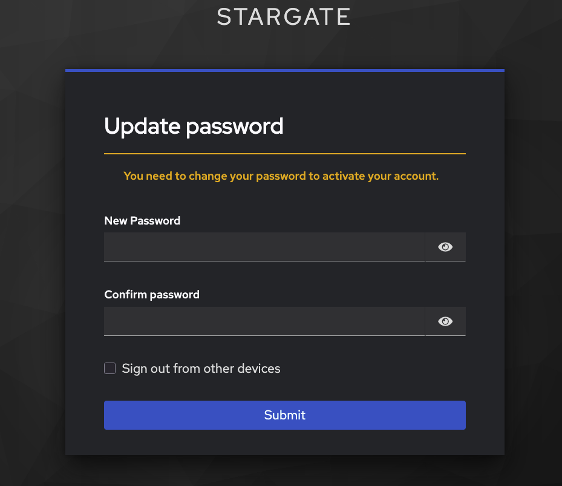

### Step 12 - Update account information


Complete your account profile by entering your first name and last name. The email address is pre-filled. Click "Submit" to continue.

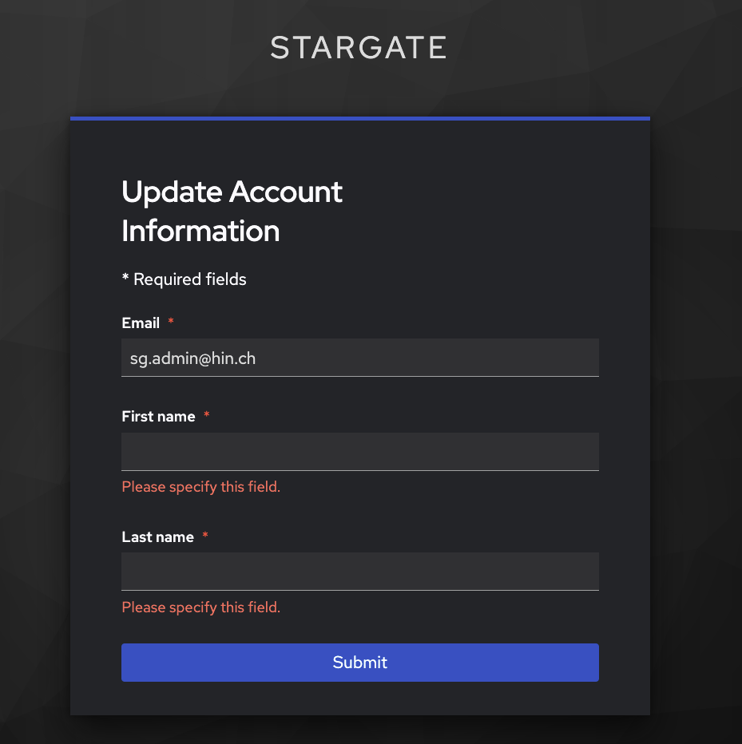

### Step 13 - Initial configuration and domain setup


On this screen, configure your initial settings:

- Verify that all your current trusted domain(s) within the HIN Community are displayed correctly.
- Select which trusted domain(s) should be **Enabled** to obtain peer certificates from the HIN Certification Authority (HIN CA).
- Indicate for which domain(s) the `sec.<domain>` prefix is already configured ("Use sec-prefix").
- Verify that the organization name and domain owners are correct. <br> 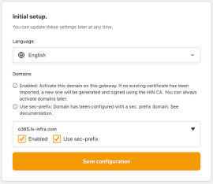{ style="position:relative;left:50%;transform:translate(-50%,0%);" } <br> 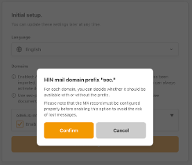{ style="position:relative;left:50%;transform:translate(-50%,0%);" }
- Import the existing S/MIME certificate file (`.p12`/`.pfx`) from the existing MGW:
    1. Expand the domain and select the **P12/PFX File** option.
    2. If no password has been set for the certificate file, leave the password field empty.
    3. Click **"Import Certificate"**.
    4. After the certificate has been imported, the message *Certificate imported successfully* is displayed.
- Click **"Save Configuration"** at the end of the page to save the changes.

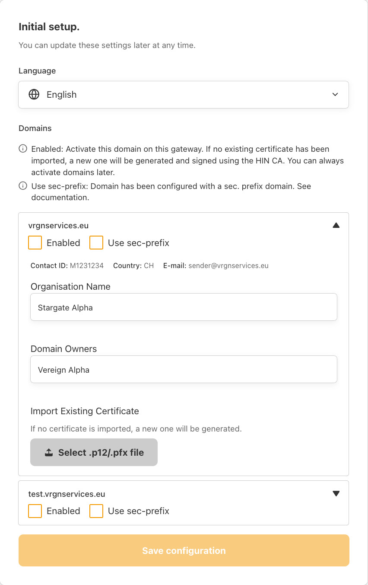

!!! warning
    - At least one domain must be **Enabled** to continue with the onboarding process. The "Save configuration" button will only become active once this requirement is met.
    - If you notice that not all trusted domains are displayed or that the organisational information is incorrect, please contact HIN Support by email or phone (**support@hin.ch** / **0848 830 740**).

!!! danger "Import your existing private key"
    If you do **not** import the private key from your existing MGW, a new key will be issued. This may result in messages not being decryptable for up to **6 hours**, which could lead to **data loss**.

### Step 14 - Configure mail transport


On this screen, configure your mail transport settings for the secure mail relay setup.

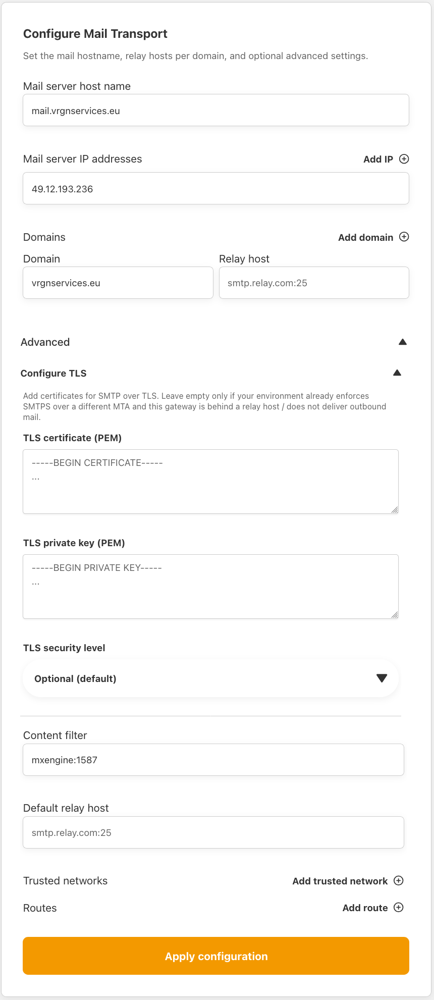

The following settings are available:

| Setting | Description |
|---------|-------------|
| **Mail server host name** | The FQDN of this mail gateway instance (e.g. `mail.example.com`). |
| **Mail server IP addresses** | The public IP address(es) of this server. Add additional IPs if the server is reachable on multiple addresses. |
| **Domains** | Each domain that this gateway handles, along with its relay host (the internal mail server to which inbound mail is delivered). |
| **Default relay host** | The default SMTP relay for outbound delivery. |

Under the **Advanced** section, you can optionally configure:

| Setting | Description |
|---------|-------------|
| **Configure TLS** | TLS certificate settings for SMTP connections. |
| **Content filter** | The internal content filter endpoint (default: `mxengine:1587`). |
| **Trusted networks** | Additional networks allowed to relay through this gateway. |

Additional actions:

- Add additional domains by clicking "Add domain", if required.
- Expand the Advanced section to fine-tune mail transport parameters.

!!! note
    Ensure that all relay host and domain configurations are correct before proceeding.

Once the configuration has been reviewed and completed, click "Apply configuration" to continue.

### Step 15 - Configure whitelist headers


Click **"Domains"**, then select **"Whitelist headers"**.

Enter the key exactly as configured in the mail server.

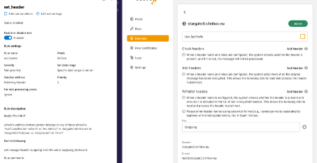{ style="position:relative;left:50%;transform:translate(-50%,0%);" }

### Step 16 - Peer certificates


Peer certificates are issued by the HIN Certification Authority (HIN CA) for enabled domains.

Once the onboarding is complete, navigate to the **Peer certificates** section in the dashboard and click the **"Sync certificates"** button to synchronise your peer certificates from the HIN CA.

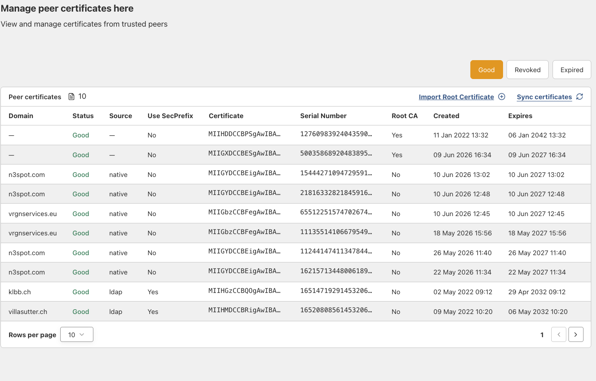

### Step 17 - Validate peer certificates


Ensure that your domain has received its policy-based peer certificate under **"Domains"**. The status of each domain must be **"Good"**.

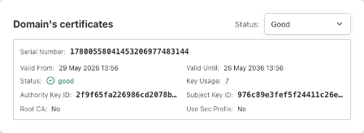{ style="position:relative;left:50%;transform:translate(-50%,0%);" }

!!! question
    Contact HIN Support by email or phone (**support@hin.ch** / **0848 830 740**) if you encounter any issues.

### Step 18 - Configure mail server


If you followed the recommended approach by exporting the private key, importing it into the HIN Gateway, and keeping the **same IP address** as the existing MGW, no changes are required on the email server.

Otherwise, configure your mail server or the associated components so that traffic is routed via the new HIN Gateway. Check and update the following settings, if required:

- SMTP relay / smart host
- Connectors
- Transport rules
- Routing domains

See [Exchange Integration](Exchange-integration.md) for detailed instructions.

### Step 19 - Test prior to switchover


Repeat the "Step 1.1 - Smoke test". In addition to the smoke test, please test and confirm the following:

**Outgoing:**

- Verify that the mail server is configured to send emails to the HIN Gateway using an SMTP relay or Exchange connector.
- Verify that the HIN Gateway can send emails to recipients outside the HIN Community.
- Verify that the HIN Gateway can send emails to recipients inside the HIN Community via WireGuard.

**Incoming:**

- Verify that encrypted emails can be received from the HIN Community via WireGuard. A sender from the `hin.ch` domain is the easiest test path.
- Verify that encrypted emails can be received from the HIN Community via SMTP using S/MIME.
- Verify that replies from senders outside the HIN Community to an initial secure email (HIN Mail-SEAL) can reach the HIN Gateway.
- Verify that plain-text emails can be received from external senders outside the HIN Community.

### Step 20 - Validation after switchover


Confirm:

- Emails delivered
- Encryption applied
- No delays or bounces
- Logging successful

Complete the **"Acceptance Report"** and return it to your HIN representative.

### Step 21 - Take existing MGW out of service


!!! warning
    Do not delete the existing MGW VM immediately - keep it safe until everything is up and running.

1. **Ensure there is no active traffic** - check:
    - No domains are pointing to the MGW (DNS, SMTP, connectors).
    - No emails are being forwarded via the old appliance.
2. **Archive logs** - export and save:
    - Email logs
    - Security/audit logs
    - Required for compliance and troubleshooting
3. **Clean-up (optional)** - remove:
    - Firewall rules
    - DNS entries
    - Routing configurations that reference the existing MGW

### Step 22 - Change the password of the VM


Please make sure that the VM credentials which were provided to you initially are changed to your own defined password, and keep them in a secured and safe place.

## Annex 1 - Backing up and restoring the appliance settings


To back up or restore the settings of your HIN appliance, click the **"Administration"** menu in the web administration portal.

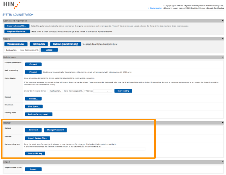{ style="position:relative;left:50%;transform:translate(-50%,0%);" }

### Backing up settings

Before you create a backup of the current HIN appliance settings, you must set a backup password. This password is required if you need to restore the backup later.

- To set or change the backup password, click **"Change Password"**.
- To create and download a backup file, click **"Download"**.

### Changing the backup password

To change the password for future backups, click **"Change Password"**.

!!! note
    The new password only applies to backups created **after** the password has been changed. Existing backup files remain protected by the password that was set when they were created.

### Restoring settings

To restore appliance settings from a backup file, click **"Import Backup File..."**.

In the dialog window, select the required backup file and enter the password associated with that backup. The appliance settings will then be restored from the selected backup file.

### Backup using SCP

The MGW supports backing up the appliance via SCP.

To use this option, the public key of the system that will access the MGW must be stored under **"Backup using SCP"**. The backup is generated automatically every day at midnight and is stored on the MGW as `backup.tgz`.

Using the configured public key, the backup file can be retrieved via SCP with the operating system user `backup`. A typical SCP command to retrieve the backup file is:

```bash
scp backup@192.168.1.60:/backup.tgz .
```

This command downloads the file `backup.tgz` from the MGW to the current local directory.

!!! note
    If you enter a new public key, the existing key will be replaced.
