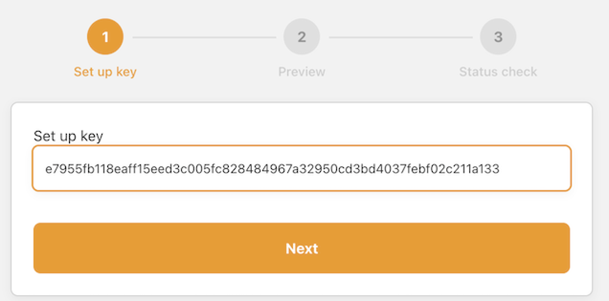
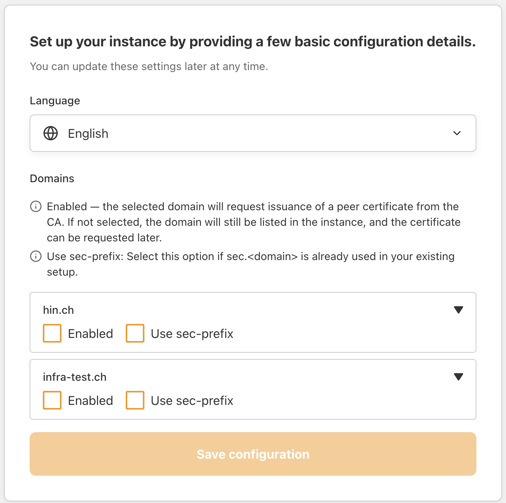
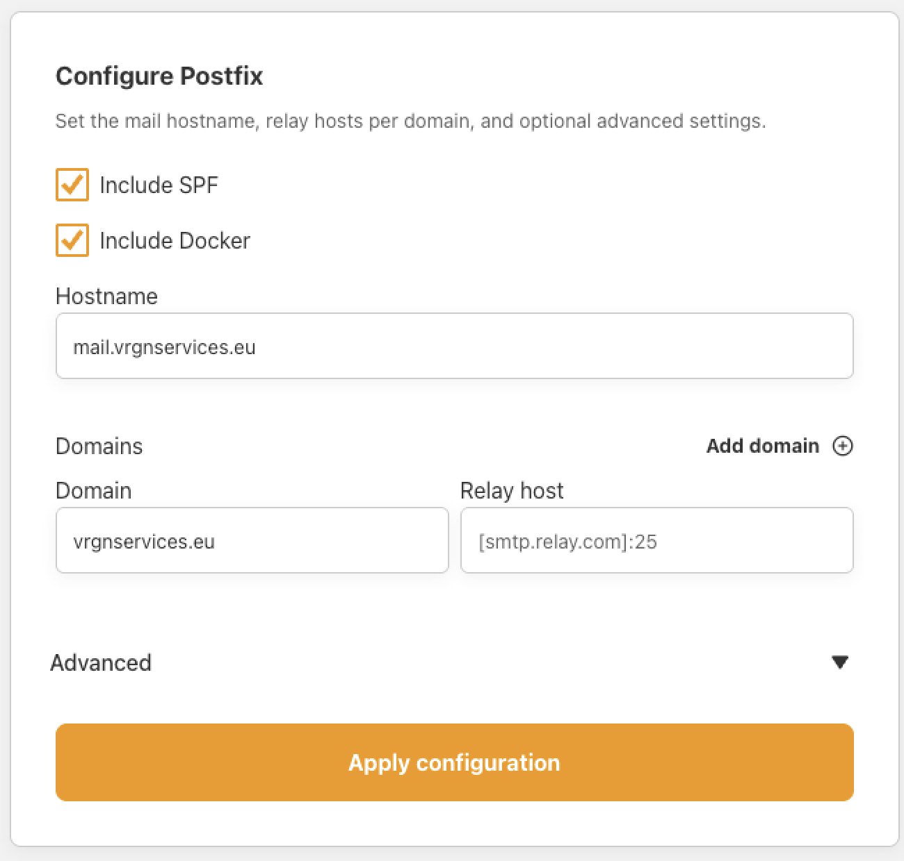
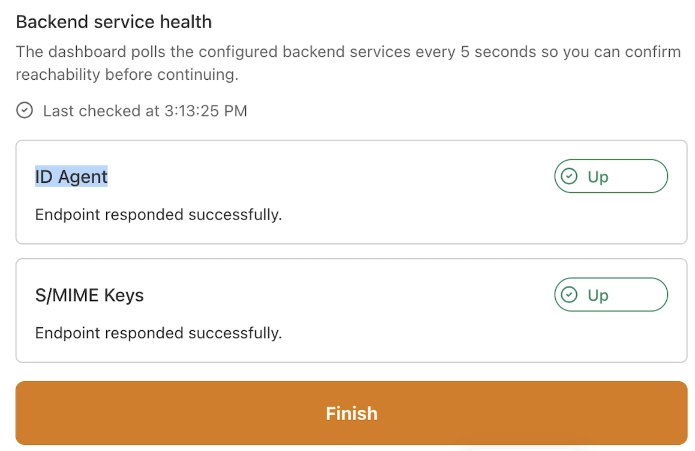
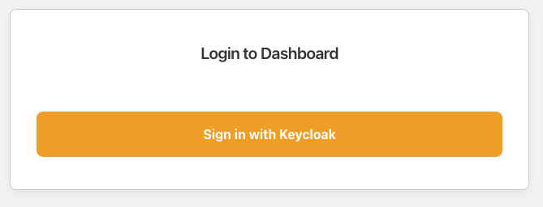
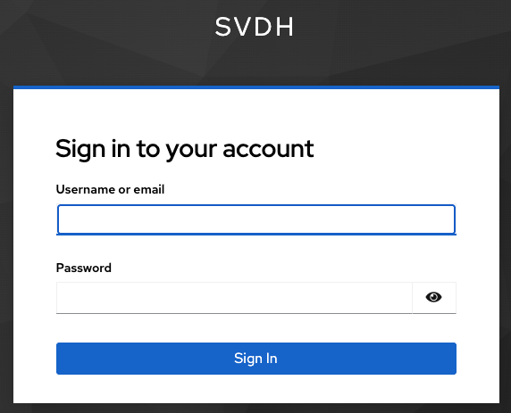
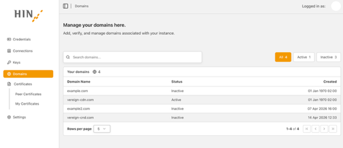

# HIN Gateway - Technical Installation Process

!!! info "Rollout HIN Gateway 2026 - Version 1.1"

## Introduction

This document provides a comprehensive guide to the technical installation and migration process to the HIN Gateway ("Stargate Appliance"). It is intended for HIN customers, IT administrators and system engineers who are responsible for the deployment, configuration and transition from the existing Mail Gateway (MGW) to the HIN Gateway.

The HIN Gateway is a secure email gateway solution that enables trusted, encrypted and policy-driven communication within the HIN Trust Circle. It acts as a central intermediary between internal email infrastructures and external communication partners, ensuring that all email traffic is transmitted securely, complies with the organisation's policies and meets HIN's security standards.

## Overview of the mail flow

- **Incoming emails** are routed via the HIN Gateway, where they are validated, decrypted (if necessary) and checked against trust and security policies before being forwarded to the internal mail server.
- **Outgoing emails** are sent from internal systems to the HIN Gateway, where encryption, routing and policy enforcement are applied before they are transmitted to external recipients.
- **Communication between HIN gateways** is secured by peer certificates and WireGuard tunnels, ensuring trusted communication between domains.

## Installation and migration process

The structured, step-by-step procedure described in this document covers the following points:

1. Preparation and fallback planning
2. Installation and configuration of the HIN Gateway appliance
3. Domain activation and certificate validation
4. Mail server integration and routing configuration
5. Testing, transition to production and post-migration validation
6. Decommissioning of the old MGW

!!! tip
    To minimise risks, the HIN Gateway is deployed in parallel with the existing MGW, enabling controlled testing and validation prior to the switchover to live operation.

HIN's objective in this process is to ensure a secure, smooth and fully validated migration that causes minimal disruption to operations and guarantees the uninterrupted continuity of email services.

## Overview of the installation steps

| Step | Topic | Responsibility |
| :--: | :---- | :------------: |
| 1.1 | Backing up the old MGW | Customer |
| 1.2 | Contingency plan | Customer |
| 2 | WireGuard | Customer |
| 3 | Select target VM | Customer |
| 4 | Load VM image | Customer |
| 5 | Network connection to the VM | Customer |
| 6 | Access via the browser | Customer |
| 7 | Enter setup key | Customer |
| 8 | Initial Configuration and Domain Setup | Customer |
| 9 | Configure Mail Relay | Customer |
| 10 | Backend Service Health Check | Customer |
| 11 | Log in to the dashboard | Customer |
| 12 | Enter Keycloak credentials | Customer |
| 13 | Check domains | Customer |
| 14 | Activate domains | Customer |
| 15 | Peer certificates | HIN |
| 16 | Validate peer certificates | Customer |
| 17 | Configure mail server | Customer |
| 18 | Tests before the switchover | Customer |
| 19 | Switchover to production | Customer |
| 20 | Validation following the switchover | Customer |
| 21 | Grace period | HIN |
| 22 | End of the waiting period | Customer |
| 23 | Take MGW out of service | Customer |

## Detailed steps

### Step 1.1 - Backing up the old MGW


Back up the old MGW appliance and ensure that the VM is not deleted until the migration has been successfully completed and accepted.

### Step 1.2 - Fallback scenario


We recommend setting up the new HIN Gateway Appliance in parallel with the old MGW to enable testing and validation without impacting the production environment. Once the HIN Gateway Appliance has been successfully installed, email traffic can be routed via both platforms during the transition phase.

Should problems arise with email traffic on the HIN Gateway, a fallback can be set up by redirecting specific domains back to the old MGW.

### Step 2 - WireGuard


Configure the WireGuard port 19818 (TCP/UDP) in your firewall:

- Incoming and outgoing traffic
- Allow traffic: any-to-any (or restrict according to your security policy)

!!! info "Why WireGuard?"
    The WireGuard port fulfils two important functions:

    1. The HIN Gateway Appliance uses this port to obtain peer certificates from the HIN CA.
    2. It uses this port to establish a secure tunnel to other HIN Gateway Appliances, through which secure data exchange (e.g. email traffic) takes place.

### Step 3 - Select target VM


Select one of the available virtual images and provision it as described in the installation guide on the HIN Gateway service page:

- [Docker Installation](Docker-deploy.md)
- [Helm Charts](helm-deploy.md)
- VM Image Installation:
    - [Azure VM Image](vm/Azure-image-install.md)
    - [Windows 11 Pro (Hyper-V) Image](vm/Windows11pro-image-install.md)
    - [VMware image](vm/VMware-image-install.md)
    - [Proxmox image](vm/Proxmox-image-install.md)
- [Exchange integration](Exchange-integration.md)

### Step 4 - Load VM image


Upload the selected VM to your hypervisor.

### Step 5 - Network connection to the VM


Ensure that the VM has a network connection with a static IP address.

**Option A:** You can configure your router's DHCP server to always assign the same IP address based on the VM's MAC address.

**Option B:** Log in locally via the VM console and manually configure a static IP address.

!!! warning "Network must be configured before first boot"
    The VM image runs an automatic installation on first boot. If the network is not yet configured (no IP address assigned via DHCP or static config), the installation will fail because the server IP cannot be detected.

    If this happens, configure the network manually, then run:

    ```bash
    cd /root/stargate-deployment/docker-compose
    ./scripts/purge.sh
    ./scripts/install.sh
    ```

    The install script will auto-detect the server's IP from the default route. Any reachable IP (public or private) is sufficient - the actual public endpoint is configured later through the dashboard.

!!! tip
    If you choose Option B, use the HIN Admin Credentials provided to you by your HIN contact at T-4 via email. You will be prompted to change the password when you log in for the first time.
    
    !!! question
        If you do not have the HIN admin credentials, please contact HIN Support by email.
        
        [Click here to send an Email](mailto:support@hin.ch?subject=Password%20required%20for%20VM%20installation.&body=Hello%20dear%20Support,%0A%0AI%20would%20like%20to%20receive%20the%20password%20for%20a%20VM%20installation.%0A%0APLEASE%20PROVIDE%20YOUR%20CUSTOMER%20INFO%20HERE){ .md-button style="position:relative;left:50%;transform:translate(-50%,0%);" }

### Step 6 - Access via the browser


Open a browser and enter the IP address and port configured for the VM. You should see the initial setup screen.

```
https://<VM IP address>
```

### Step 7 - Enter setup key


Enter the setup key that you received via email from your HIN contact person in T-4. Click on "Next".



!!! question
    If you do not have the setup key, please contact HIN Support via email.
    
    [Click here to send an Email](mailto:support@hin.ch?subject=Password%20required%20for%20VM%20installation.&body=Hello%20dear%20Support,%0A%0AI%20would%20like%20to%20receive%20the%20password%20for%20a%20VM%20installation.%0A%0APLEASE%20PROVIDE%20YOUR%20CUSTOMER%20INFO%20HERE){ .md-button style="position:relative;left:50%;transform:translate(-50%,0%);" }

### Step 8 - Initial Configuration and Domain Setup


Check that the public IP address displayed in the "Endpoint" field is correct. If it is incorrect, update it accordingly. On this screen, you can now:

- Select your preferred language.
- Verify that all your current trusted domains within the HIN Community are displayed correctly.
- Verify that all organisational information is displayed correctly.
- Select which trusted domain(s) should be enabled to obtain peer certificates from the HIN Certification Authority (HIN CA).
- Indicate for which domain(s) the `sec.<domain>` is already configured.



!!! warning
    - At least one domain must be enabled in order to continue with the onboarding process. The "Save configuration" button will only become active once this requirement is met.
    - If you notice that not all trusted domains are displayed or that the organisational information is incorrect, please contact your HIN representative to have this verified and corrected.

Click on "Save configuration".

### Step 9 - Configure Mail Relay


On this screen, configure your mail relay settings for the secure mail relay setup.



The following options are available:

| Option | Description |
|--------|-------------|
| **Include SPF** | The system reads the SPF record from DNS, extracts the defined networks, and automatically adds them to the allowed relay networks. This allows messages originating from those networks to be accepted. |
| **Include Docker** | Similar to the previous option, this applies predefined settings intended for VM and Docker installations. For Kubernetes installations, this option must remain disabled. |
| **Hostname** | If multiple domains are configured, the first domain in the list is automatically used as the hostname. This setting only defines the hostname of the instance. |
| **Domain** | The system reads the configured domain and its MX records. Based on this information, the relay configuration is automatically created. When a message is received for processing, the system determines to which SMTP server the message must be forwarded for final delivery. |

Additional actions:

- Add additional domains by clicking "Add domain", if required.
- Optionally expand the Advanced section to configure additional mail relay parameters.

!!! note
    Ensure that all relay host and domain configurations are correct before proceeding.

Once the configuration has been reviewed and completed, click "Apply configuration" to continue.

### Step 10 - Backend Service Health Check


Once the installation is complete, the system will display the status "Up" for all backend services.



Check that all services can be accessed successfully. Click on "Finish".

!!! failure "If the installation fails"
    If the installation fails, the affected services will be displayed with a red status.

    Options in the event of an error:

    - Restart the installation from step 5.
    - Contact HIN Support.

### Step 11 - Log in to the dashboard


Click on "Sign in with Keycloak".



### Step 12 - Enter Keycloak credentials


Enter the Keycloak username and password received in T-4.



!!! question
    If you do not have these login details, please contact HIN Support via email.
    
    [Click here to send an Email](mailto:support@hin.ch?subject=Password%20required%20for%20VM%20installation.&body=Hello%20dear%20Support,%0A%0AI%20would%20like%20to%20receive%20the%20password%20for%20a%20VM%20installation.%0A%0APLEASE%20PROVIDE%20YOUR%20CUSTOMER%20INFO%20HERE){ .md-button style="position:relative;left:50%;transform:translate(-50%,0%);" }

After logging in, check the following:

- Contact name
- Address
- Email
- List of trusted domains

!!! info
    At this stage, customers can only enable, disable or remove domains. To add new domains, please follow the existing CSR process.

### Step 13 - Verify domains


Check the list of trusted domains. If there are any errors, contact HIN Support.



### Step 14 - Activate domains


Select the domain(s) and enable them so that traffic is routed via the HIN Gateway. Click "Finish".

### Step 15 - Peer certificates


Peer certificates are issued by the HIN Certification Authority (HIN CA) for activated domains.

### Step 16 - Validate peer certificates


Ensure that each domain has received its policy-based peer certificate. Contact HIN Support if you encounter any issues.

### Step 17 - Configure mail server


Configure your mail server or the associated components so that traffic is routed via the new HIN Gateway Appliance:

- SMTP relay / Smart host
- Connectors
- Transport rules
- Routing domains

See [Exchange Integration](Exchange-integration.md) for detailed instructions.

### Step 18 - Tests prior to migration


Check the email flow using a test domain:

- Internal to External
- External to Internal
- Encrypted communication

### Step 19 - Go-live


Migrate all domains to the HIN Gateway. Update:

- SMTP relay / Smart host
- Email connectors (e.g. Exchange, M365)
- DNS MX records (if applicable)

### Step 20 - Validation after the migration


Confirm:

- Emails delivered
- Encryption applied
- No delays or bounces
- Logging successful

Complete the acceptance report and return it to HIN.

### Step 21 - Transition period


A one-month transition period will be granted to transfer all trusted domains to the HIN Gateway.

!!! warning "Consequences of not migrating within the transition period"
    Should this transition period not be observed, the following potential consequences may arise:

    - **Incomplete domain migration** - Certain trusted domains may continue to be routed via the old MGW rather than via the HIN Gateway. This leads to inconsistent email forwarding and trust relationships.
    - **Loss of secure communication** - Domains that have not been migrated do not benefit from the HIN-based encryption and trust policies. Secure communication via peer certificates and WireGuard tunnels may fail.
    - **Problems with email delivery** - Emails may be rejected, experience delivery delays, or be misrouted. Communication with other HIN subscribers may not work as expected.

### Step 22 - End of the transition period


All trusted domains must be migrated within the transition period.

### Step 23 - Take MGW out of service


!!! warning
    Do not delete old MGW VM immediately, keep it safe till everything is up and running.

1. **Ensure there is no active traffic** - Check:
    - No domains are pointing to the MGW (DNS, SMTP, connectors).
    - No emails are being forwarded via the old appliance.

2. **Final validation** - Ensure that all domains have been fully migrated to the HIN Gateway.
    - Run the mail flow tests again.

3. **Archive logs** - Export and save:
    - Email logs
    - Security/audit logs
    - Required for compliance and troubleshooting

4. **Shutdown procedure** - Shut down the MGW VM correctly.
    - DO NOT delete immediately (recommended retention period).

5. **Clean-up (optional)** - Remove:
    - Firewall rules
    - DNS entries
    - Routing configurations that reference the old MGW
