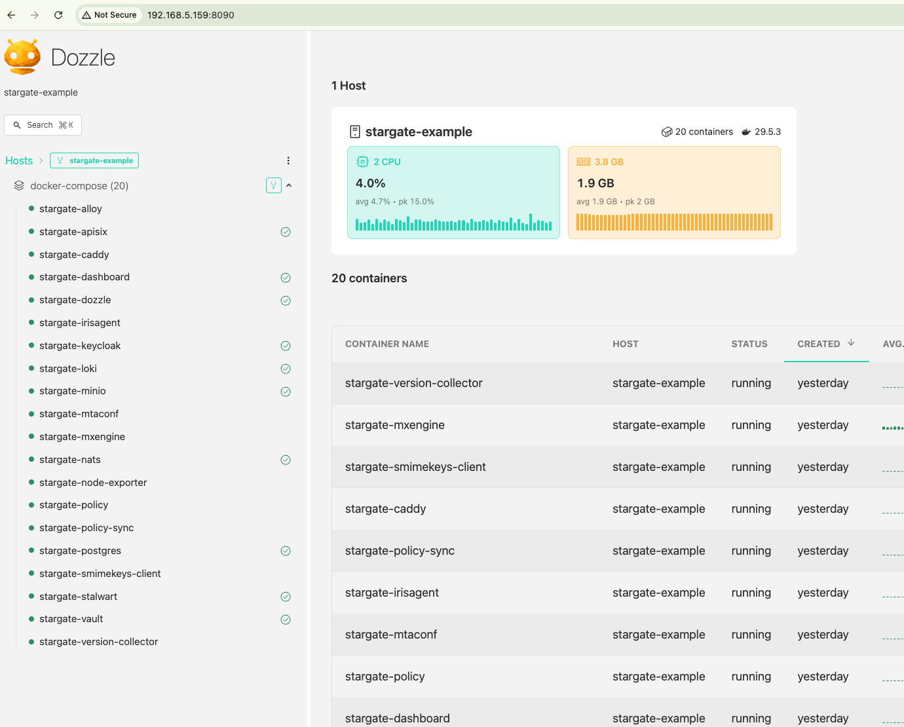
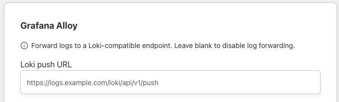

# Monitoring and Logs

Stargate includes built-in monitoring and log collection services that run alongside the application containers.

## Components

| Service | Port | Purpose |
|---------|------|---------|
| node-exporter | 9100 | Host-level metrics (CPU, memory, disk, network) for Prometheus |
| version-collector | - | Collects app versions from `/liveness` endpoints |
| Alloy | 12345 | Docker log collector - ships container logs to Loki |
| Loki | 3100 (internal) | Local log aggregation backend |
| Dozzle | 8090 | Real-time web-based container log viewer |

---

## Dozzle - Local Log Viewer

Dozzle provides a web-based UI to view real-time logs from all Stargate containers.

**Access:** From the local network, open `http://<SERVER_IP>:8090` in a browser.

Logs are organized by service. By selecting a specific service, you can view its corresponding log entries and details.



---

## Grafana Alloy - Log Forwarding

Grafana Alloy collects logs from all Stargate application containers and writes them to the local Loki instance. Optionally, logs can also be forwarded to a remote Loki-compatible endpoint for centralized monitoring.

### How it works

1. Alloy discovers Stargate containers via the Docker socket
2. Logs are always written to the **local Loki** instance (used by the dashboard for log export)
3. If a remote Loki URL is configured, logs are **additionally forwarded** to that endpoint

### Configuring remote log forwarding

From the HIN Gateway dashboard, navigate to the **Settings** page. Under the **Grafana Alloy** section, enter the Loki push URL of your remote log collection server:



The URL should follow the standard Loki push API format:

```
https://logs.example.com/loki/api/v1/push
```

Leave the field blank to disable remote log forwarding.

!!! note
    Changes take effect within 1 minute (Alloy polls the dashboard configuration on that interval). No container restart is required.

### Requirements on the remote side

Your remote Loki endpoint must be reachable from the Stargate server over HTTPS (port 443). If you use IP-based allowlisting on your ingress, add the Stargate server's public IP.

---

## Prometheus Metrics

Stargate exposes Prometheus-compatible metrics endpoints from its application containers. These can be scraped by any Prometheus-compatible server for centralized metrics collection.

### Available endpoints

| Service | Port | Path |
|---------|------|------|
| smimekeys-client | 2113 | `/metrics` |
| irisagent | 2114 | `/metrics` |
| policy | 2115 | `/metrics` |
| mxengine | 2116 | `/metrics` |
| node-exporter | 9100 | `/metrics` |
| APISIX | 9091 | `/apisix/prometheus/metrics` |

### Scrape configuration

Add the Stargate server as a target in your Prometheus configuration. Example for a single instance:

```yaml
scrape_configs:
  - job_name: 'stargate-<name>-smimekeys'
    static_configs:
      - targets: ['<STARGATE_IP>:2113']
        labels:
          environment: 'stargate-<name>'
          service: 'smimekeys-client'
    metrics_path: /metrics

  - job_name: 'stargate-<name>-irisagent'
    static_configs:
      - targets: ['<STARGATE_IP>:2114']
        labels:
          environment: 'stargate-<name>'
          service: 'irisagent'
    metrics_path: /metrics

  - job_name: 'stargate-<name>-policy'
    static_configs:
      - targets: ['<STARGATE_IP>:2115']
        labels:
          environment: 'stargate-<name>'
          service: 'policy'
    metrics_path: /metrics

  - job_name: 'stargate-<name>-mxengine'
    static_configs:
      - targets: ['<STARGATE_IP>:2116']
        labels:
          environment: 'stargate-<name>'
          service: 'mxengine'
    metrics_path: /metrics

  - job_name: 'stargate-<name>-node'
    static_configs:
      - targets: ['<STARGATE_IP>:9100']
        labels:
          environment: 'stargate-<name>'
          service: 'node-exporter'
    metrics_path: /metrics
```

Replace `<STARGATE_IP>` with the server's public or private IP and `<name>` with a deployment identifier (e.g., `prod`, `customer-name`).

!!! tip
    The `environment` and `service` labels enable filtering in Grafana dashboards across multiple Stargate instances.

### Firewall requirements

The metrics ports (2113-2116, 9100) must be reachable from your Prometheus server. If you restrict access by IP, add your monitoring server's IP to the firewall rules.

---

## Node Exporter

The node-exporter service exposes standard host-level metrics (CPU, memory, disk I/O, network) on port **9100**. It also includes a textfile collector that exposes custom metrics from the version-collector sidecar (application version information).

---

## Summary of exposed ports

| Port | Service | Protocol | Purpose |
|------|---------|----------|---------|
| 8090 | Dozzle | HTTP | Local log viewer UI |
| 9100 | node-exporter | HTTP | Host metrics (Prometheus) |
| 2113 | smimekeys-client | HTTP | App metrics (Prometheus) |
| 2114 | irisagent | HTTP | App metrics (Prometheus) |
| 2115 | policy | HTTP | App metrics (Prometheus) |
| 2116 | mxengine | HTTP | App metrics (Prometheus) |
| 9091 | APISIX | HTTP | Gateway metrics (Prometheus) |
